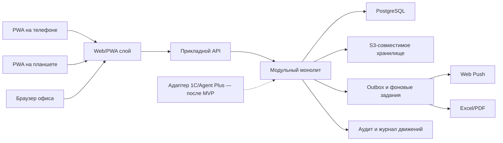

# Архитектурная основа: анализ и решения на согласование

Статус: архитектурная основа утверждена владельцем 30.07.2026, остаются технические проверки перед production; код приложения не создавался

Связанный блок: B01 дорожной карты

Правило перехода: решения со статусом `Блокирует старт` должны быть утверждены до создания каркаса приложения

## 1. Цель документа

Документ фиксирует рекомендуемую архитектурную основу и спорные решения. Это не окончательная спецификация реализации. После ответа владельца принятые решения оформляются отдельными ADR, а только затем начинается создание приложения.

## 2. Ограничения, которые архитектура обязана сохранить

- около 70 зарегистрированных сотрудников;
- телефон, производственный планшет и офисный компьютер;
- доступ внутри и вне фабрики;
- PWA и push-уведомления;
- серверное время Europe/Moscow;
- роли с областью ответственности;
- одноразовый динамический QR примерно на 5 секунд;
- параллельная работа цехов и групп погрузки;
- встречное подтверждение передач;
- склад уменьшается только после завершенной операции;
- неизменяемый аудит критичных действий;
- план после 10:00 должен создаваться ровно один раз и быть воспроизводимым;
- ограниченный офлайн не должен разрешать незаметно завершать критичные движения;
- Excel/PDF и массовый импорт;
- будущая 1С/Agent Plus не должна определять внутреннюю модель MVP.

## 3. Что показал анализ исходных материалов

### ТЗ

Главная техническая сложность проекта — не количество пользователей, а согласованность нескольких параллельных подтверждений и возможность восстановить происхождение каждой цифры. Поэтому приоритеты архитектуры:

1. целостность данных;
2. идемпотентность повторных запросов;
3. журнал движений и аудит;
4. простые интерфейсы частых операций;
5. наблюдаемость и восстановление;
6. только затем — оптимизация скорости и расширение функций.

### Рабочий Excel

Книга пригодна как источник для анализа и разовой миграции, но не как каноническая модель:

- нормы повторяются блоками по дням и территориям;
- товары расположены в нескольких секциях одной строки;
- в одном файле смешаны нормы, факт, подписи, сотрудники, адреса, телефоны, полуфабрикаты и архив;
- встречаются опечатки и разные структуры исторических листов;
- формулы зависят от конкретных координат.

Архитектурное следствие: данные импортируются в промежуточную область, нормализуются и только после проверки становятся рабочими. Формулы и расположение ячеек не переносятся в доменную модель.

## 4. Рекомендуемая схема

### Рекомендация верхнего уровня

Модульный монолит в одном репозитории:

- клиент: TypeScript, React, Next.js App Router, PWA;
- сервер: TypeScript, NestJS с REST API и OpenAPI;
- база: PostgreSQL;
- фоновые задания: отдельный worker, outbox и очередь на PostgreSQL;
- файлы: S3-совместимое объектное хранилище;
- push: стандартный Web Push с VAPID;
- развертывание: контейнеры, отдельные процессы web/API/worker;
- наблюдаемость: структурные логи, метрики, трассировки и ошибки;
- тесты: модульные, API/БД, Playwright, нагрузочные и безопасность.

Next.js имеет отдельное официальное руководство по PWA, manifest, service worker и Web Push, а также поддерживает самостоятельное размещение. Это делает его подходящим кандидатом, но работу push и камеры все равно нужно подтвердить на конкретных устройствах пилота: [официальное руководство Next.js по PWA](https://nextjs.org/docs/app/guides/progressive-web-apps), [руководство по self-hosting](https://nextjs.org/docs/app/guides/self-hosting).

Для базы рекомендуется поддерживаемая стабильная версия PostgreSQL, на текущем этапе — PostgreSQL 18 с актуальным минорным обновлением. Проект PostgreSQL поддерживает основную версию пять лет и рекомендует ставить актуальный минорный выпуск: [официальная политика версий PostgreSQL](https://www.postgresql.org/support/versioning/).

Безопасность разрабатывается и проверяется по OWASP ASVS 5.0.0 как измеримому набору требований, а не только по общему чек-листу: [официальная страница OWASP ASVS](https://owasp.org/www-project-application-security-verification-standard/).

## 5. Почему модульный монолит

Для 70 сотрудников микросервисы не дают необходимой пользы, но увеличивают число точек отказа, сложность транзакций, мониторинга, обновлений и восстановления.

Модульный монолит позволяет:

- проводить приемку склада и списание в одной транзакции;
- централизованно проверять роли и аудит;
- развертывать одну согласованную версию;
- выделить в будущем интеграционный или отчетный сервис без переделки доменной модели.

Обязательное условие: модули имеют явные границы и не обращаются к чужим таблицам в обход прикладного интерфейса.

Предлагаемые модули:

- Identity — сотрудники, роли, сессии, устройства;
- Attendance — смены, QR, ручные отметки;
- Catalog — товары, цехи, причины, календарь;
- Logistics — территории, машины, водители, группы;
- Norms — недельные и разовые нормы;
- Planning — снапшоты и версии производственного плана;
- StoreOrder — заказ фирменного магазина;
- Production — задания, партии, факт, брак;
- Warehouse — приемка, движения, остатки;
- Loading — строки и двойное подтверждение;
- Inventory — физический пересчет и расхождения;
- Returns — годный возврат, распределение и списание;
- Spoilage — физическая порча и ручная сверка;
- Notifications — лента, push и эскалации;
- Reporting — чтение, печать, Excel/PDF;
- Import — staging, проверки и подтверждение;
- Audit — неизменяемые бизнес-события;
- Integration — внешние идентификаторы и будущие адаптеры.

## 6. Ключевые технические правила

### 6.1. Данные и остатки

Источник истины — журнал подтвержденных движений. Текущее количество может храниться как быстрое представление, но должно сверяться с движениями.

Не редактировать подтвержденное движение. Исправление создает компенсирующую операцию с причиной, автором и ссылкой на исходную запись.

Отдельные учетные корзины:

- свободный склад;
- ожидает приемки;
- зарезервировано погрузкой;
- общий пул возврата;
- заблокировано заявкой на списание;
- списано/порча;
- производственный брак.

### 6.2. Конкурентность и повторные запросы

Каждая критичная команда получает ключ идемпотентности. Повтор из-за плохой связи возвращает прежний результат и не создает второе движение.

Для документов используется версия. Если два пользователя меняют один объект, второй получает понятный конфликт, а не перезаписывает изменения.

Операции списания блокируют или атомарно проверяют остаток. Отрицательный остаток по умолчанию запрещен.

### 6.3. План в 10:00

План формируется фоновым заданием с распределенной блокировкой в базе:

1. определить следующую рабочую дату;
2. зафиксировать входной снапшот;
3. посчитать строки;
4. сохранить версию;
5. опубликовать;
6. записать аудит;
7. поставить уведомления в outbox.

Повторный запуск на ту же дату либо возвращает существующий план, либо создает новую административную версию по явной команде. Нельзя пересчитать опубликованный план незаметно.

### 6.4. Динамический QR

Рекомендуемый MVP-вариант:

- аутентифицированный телефон получает короткоживущий непрозрачный токен;
- токен содержит/связан с сотрудником, действием, сроком, сессией и уникальным `jti`;
- планшет передает токен серверу;
- сервер проверяет срок, сотрудника, зарегистрированный терминал и одноразовость;
- принятие токена атомарно фиксируется;
- источником времени является сервер.

Не помещать в QR ФИО, табельный номер или другие читаемые персональные данные.

Риск: токен на 5 секунд чувствителен к задержке сети. До утверждения решения нужно измерить фактическую связь. Возможные варианты:

- строгие 5 секунд;
- 5 секунд отображения и небольшой серверный допуск;
- заранее выданный короткий пакет подписанных токенов для нестабильной связи.

Последний вариант сложнее и требует отдельного анализа replay-риска.

### 6.5. Ограниченный офлайн

Рекомендуется online-first:

- можно читать ранее загруженные справочники и задания;
- можно сохранить локальный черновик;
- нельзя окончательно принять продукцию, завершить погрузку, списать, скорректировать остаток или утвердить план без подтверждения сервера;
- после восстановления связи пользователь явно видит статус отправки и конфликт.

### 6.6. Уведомления

Бизнес-событие и push разделены. Документ считается созданным/измененным после фиксации транзакции, а push доставляется асинхронно через outbox. Ошибка push не отменяет бизнес-операцию.

Критичные события всегда видны во внутрисистемной ленте. Push — дополнительный канал.

### 6.7. Фото и файлы

- файл хранится в объектном хранилище;
- в БД — метаданные и связь с документом;
- тип, размер и содержимое проверяются;
- загрузка выполняется через короткоживущую разрешенную ссылку или серверный шлюз;
- удаление подчиняется политике хранения и аудита;
- фото недоступно по публичной постоянной ссылке.

### 6.8. API и будущие интеграции

- REST/JSON и OpenAPI для внутренних клиентов;
- внутренние неизменяемые UUID/ULID;
- внешние коды — отдельная таблица соответствий;
- версия контракта;
- outbox/inbox и ключи идемпотентности;
- адаптер 1С/Agent Plus не получает прямой доступ к таблицам.

## 7. Решения на согласование

Владелец может написать решение прямо в колонке «Ответ владельца» или отдельным сообщением по кодам A-01…A-16.

### A-01. Где размещать production

Статус: `Принято`

**Рекомендация.** Облачное размещение в согласованном регионе: управляемая PostgreSQL, объектное хранилище, резервные копии отдельно от приложения, доступ фабрики через HTTPS.

**Альтернатива.** Сервер на фабрике. Потребуются резервное питание/интернет, удаленное администрирование, отдельная копия вне здания и ответственный за оборудование.

**Нужно решить.** Регион, требования к персональным данным, бюджет, допустимость облака.

**Ответ владельца.** Timeweb Cloud. Основная production-локация — российская зона Timeweb; предварительно Санкт-Петербург, потому что там доступно S3-хранилище. Конкретные зоны доступности и тарифы выбираются при инфраструктурном прототипе.

### A-02. Базовый стек

Статус: `Принято`

**Рекомендация.** Единый TypeScript-репозиторий: Next.js PWA + NestJS API + PostgreSQL.

**Альтернатива.** React/Vite + FastAPI. Технически допустимо, но добавляет второй язык и два набора моделей/инструментов.

**Нужно решить.** Утвердить рекомендацию или назвать обязательный корпоративный стек.

**Ответ владельца.** Рекомендованный единый TypeScript-стек принят: Next.js PWA + NestJS API + PostgreSQL.

### A-03. Модель развертывания

Статус: `Принято`

**Рекомендация.** Модульный монолит, отдельные процессы web/API/worker, одна PostgreSQL.

**Альтернатива.** Микросервисы. Для MVP не рекомендуется.

**Нужно решить.** Подтвердить отсутствие обязательного требования к микросервисам.

**Ответ владельца.** Модульный монолит принят. Обязательного требования к микросервисам нет.

### A-04. База и фоновые задания

Статус: `Принято с обязательной проверкой production-БД`

**Рекомендация.** PostgreSQL 18, транзакционный outbox и PostgreSQL-очередь; Redis не вводить до подтвержденной необходимости.

**Альтернатива.** Redis/BullMQ с первого дня. Быстрее для отдельных очередей, но добавляет сервис, резервирование и согласованность.

**Нужно решить.** Управляемая или самостоятельная БД; допустим ли дополнительный Redis позже.

**Ответ владельца.** PostgreSQL 18, транзакционный outbox и очередь на PostgreSQL приняты; Redis на старте не используется. Для development/staging допустим управляемый PostgreSQL Timeweb. Для production требуется конфигурация с синхронным подтверждением записи минимум на двух узлах: документированный Timeweb-вариант или самостоятельно управляемый кластер PostgreSQL в нескольких зонах. Причина: документированный Timeweb DBaaS использует асинхронные реплики и сам по себе не обеспечивает RPO 0 для последних подтвержденных операций.

### A-05. Ограниченный офлайн

Статус: `Принято`

**Рекомендация.** Просмотр кеша и черновики офлайн; все критичные подтверждения только сервером.

**Альтернатива.** Полностью офлайн-подтверждения. Существенно увеличивает стоимость конфликтов и риск двойных движений.

**Нужно решить.** Какие операции обязаны работать при полном отсутствии связи и как долго.

**Ответ владельца.** Online-first принят. Связь на фабрике есть. Офлайн разрешены кешированный просмотр и черновики; критичные подтверждения без сервера запрещены.

### A-06. QR и качество связи

Статус: `Принято`

**Рекомендация.** Серверный одноразовый токен, отображение 5 секунд, небольшой измеренный допуск только на передачу.

**Альтернатива.** Пакет предварительно подписанных токенов для офлайн-телефона.

**Нужно решить.** Доступны ли Wi‑Fi/мобильная сеть на телефонах в точке табеля; допустим ли допуск.

**Ответ владельца.** Связь в точке табеля есть. QR показывается 5 секунд; сервер может принять уже отсканированный токен в течение дополнительного допуска до 3 секунд. Токен одноразовый, а время определяется сервером.

### A-07. Складской учет

Статус: `Принято`

**Рекомендация.** Неизменяемый журнал движений + вычисляемый/материализованный остаток; корректировки компенсирующими записями; отрицательный остаток запрещен.

**Альтернатива.** Редактируемое поле остатка. Не рекомендуется: невозможно надежно объяснить расхождение.

**Нужно решить.** Есть ли допустимые операции, которым разрешен отрицательный остаток.

**Ответ владельца.** Неизменяемый журнал движений и запрет отрицательного остатка приняты. Исправления выполняются только компенсирующими операциями с причиной и аудитом.

### A-08. Правило 10:00 и календарь

Статус: `Принято`

**Рекомендация.** Один серверный запуск в 10:00 Europe/Moscow для следующего производственного дня, определенного календарем; входы фиксируются снапшотом.

**Неясность.** В ТЗ четверг без производства и пятница без вывоза, но Excel содержит пятничные варианты территории 9 на листе четверга.

**Нужно решить.** Точное правило территории 9 и праздничных переносов.

**Ответ владельца.** Общие правила четверга и пятницы сохраняются, но для территории 9 допускается исключение: иногда продукция производится в среду для пятничного маршрута, и в пятницу территория 9 выезжает. Это не зашивается в код как постоянное правило: администратор создает календарное исключение с отдельными датами производства и вывоза.

### A-09. Распределение свободного остатка

Статус: `Принято`

**Рекомендация.** Явная настраиваемая очередность/алгоритм распределения с объяснением результата; не вычитать общий остаток одной суммой без назначения.

**Варианты.**

- пропорционально нормам;
- по приоритету территорий;
- сначала фирменный магазин;
- вручную администратором;
- комбинированное правило.

**Нужно решить.** Как конкретно свободный остаток уменьшает потребность по строкам.

**Ответ владельца.** Автоматически распределять свободный остаток между территориями не нужно. Распределение выполняет кладовщик или администратор вручную; система показывает доступный остаток, предотвращает двойное распределение и записывает аудит. Администратор может исправить распределение компенсирующей операцией.

### A-10. Авторизация, PIN и устройства

Статус: `Пересмотрено и принято 03.08.2026`

**Рекомендация.** Пароль для первого входа/офиса, системный PIN или биометрия
через WebAuthn только на привязанном устройстве; защищенная серверная сессия;
отзыв устройства администратором. Прикладной короткий PIN не хранится и не
проверяется приложением.

**Альтернатива.** PIN как единственный пароль с любого устройства. Не рекомендуется.

**Нужно решить.** Разрешены ли несколько телефонов сотрудника и общий планшет в киоск-режиме.

**Ответ владельца.** Один сотрудник — одно привязанное личное устройство. Целевые личные устройства: Samsung/Android или iPhone. iPad используется как зарегистрированный фабричный терминал и не считается личным устройством сотрудника. Смена личного устройства выполняется через администратора с отзывом предыдущей сессии.

03.08.2026 владелец после полевой проверки изменил ежедневный сценарий: вход
выполняется только по логину и паролю на уже привязанном устройстве. Системный PIN,
Face ID и повторный пароль после входа не запрашиваются. Личная сессия продлевается
при использовании и действует до одного года; завершить её можно вручную, отзывом
устройства, блокировкой сотрудника или изменением прав. Приложение открывает рабочий
экран через сохранённую сессию.

Принят риск удобства: потерянный разблокированный телефон сохраняет доступ до
отзыва. Компенсирующие меры — системная блокировка телефона, одно активное
устройство на сотрудника, HttpOnly-cookie, CSRF, Argon2id, защита от перебора,
ролевые проверки и аудит всех изменений. WebAuthn остаётся для первичной привязки,
восстановления и фабричных терминалов, но не участвует в обычном ежедневном входе.

03.08.2026 владелец дополнительно упростил первичное подключение сотрудников.
Администратор выбирает должность и область, после чего показывает одноразовый QR.
Сотрудник сканирует QR личным телефоном, видит назначенную должность и сам вводит
ФИО, логин и пароль. Телефон привязывается без системного диалога WebAuthn, а
годовая сессия создаётся сразу. QR действует 24 часа, используется один раз, в БД
хранится только HMAC-хеш. Публичной регистрации без приглашения нет.

### A-11. Push и резервный канал

Статус: `Принято для MVP, резервный канал определить до пилота`

**Рекомендация.** Внутрисистемная лента + Web Push. Для критичных тревог определить организационный резервный канал, если push не доставлен.

**Альтернатива.** SMS/мессенджер с первого релиза — отдельный бюджет и обработка персональных данных.

**Нужно решить.** Требуется ли SMS/мессенджер и кто оплачивает канал.

**Ответ владельца.** Для MVP используется внутрисистемная лента и Web Push. Резервный организационный канал для критичных тревог определяется перед пилотом; SMS не включается автоматически.

### A-12. Резервирование и восстановление

Статус: `Принято с обязательной инфраструктурной проверкой`

**Рекомендация.**

- RPO не более 1 часа для БД;
- ежедневный полный снимок;
- объектные файлы с версионированием;
- копия в отдельном контуре;
- RTO до 4 часов;
- квартальная проверка восстановления и обязательная проверка до запуска.

**Минимум ТЗ.** Резервная копия не реже суток.

**Нужно решить.** Утвердить RPO/RTO или допустимые значения и стоимость простоя.

**Ответ владельца.** Подтвержденные пользователю операции не должны теряться: целевой RPO для них — 0. Пользователь получает успех только после надежного commit и синхронного подтверждения второй копией БД. Дополнительно нужны непрерывное архивирование WAL, ежедневная физическая копия, отдельная копия вне основного контура и регулярная проверка восстановления. Целевой RTO до 4 часов принят как проектное значение до отдельного возражения владельца.

### A-13. Сроки хранения и персональные данные

Статус: `Принято с бухгалтерской проверкой`

**Рекомендация.** Разные сроки для табеля, фото, отчетов, технических логов и неизменяемого аудита; доступ к персональным данным по минимально необходимым правам.

**Нужно решить.** Сроки и правовое основание; может ли руководитель видеть детальный табель; срок фото порчи/брака.

**Ответ владельца.** Рабочие данные доступны в системе не менее одного года. Фото брака/порчи после года могут удаляться по политике хранения. Табель, аудит и документы после года сначала переводятся в архив, а не уничтожаются, пока бухгалтер не подтвердит обязательные сроки хранения.

### A-14. Целевые устройства

Статус: `Принято, конкретные устройства указать до прототипов`

**Рекомендация.** До UI-разработки зафиксировать минимум по одному реальному Android-планшету, iPhone, Android-телефону и офисному браузеру; провести тест камеры, QR, push и печати.

**Нужно решить.** Модели устройств, версии ОС, сканер как камера или внешний сканер, доступность киоск-режима.

**Ответ владельца.** Целевые семейства устройств: Samsung/Android, iPhone, iPad и офисный браузер. Перед UI-разработкой нужно записать конкретные модели и версии ОС тестовых устройств. Камера — основной сканер; возможность внешнего сканера остается расширением.

### A-15. Фото и хранилище

Статус: `Принято`

**Рекомендация.** S3-совместимое приватное хранилище, ограничение размера и формата, автоматическое уменьшение изображения, антивирусная/типовая проверка.

**Нужно решить.** Максимальный размер, срок хранения, обязательные причины, допустимость облачного хранения.

**Ответ владельца.** Приватное S3-хранилище Timeweb, автоматическое уменьшение фото и проверка типа файла. Срок оперативного хранения фото — один год. Максимальный размер исходной загрузки определяется техническим прототипом; начальное ограничение — 10 МБ.

### A-16. Интеграция с 1С/Agent Plus

Статус: `Не блокирует MVP, кроме кодов и поля документа`

**Рекомендация.** В MVP только внешний номер, ручной статус сверки и таблица соответствий. Автоматический обмен — отдельный будущий блок.

**Нужно решить.** Формат номера, источник товарного кода, контакт владельца 1С/Agent Plus.

**Ответ владельца.** Не заполнено.

## 8. Итог согласования от 30.07.2026

Приняты:

- Timeweb Cloud как инфраструктурная площадка;
- Next.js PWA + NestJS + PostgreSQL 18;
- модульный монолит и отдельный worker;
- PostgreSQL-очередь и outbox без Redis на старте;
- online-first и серверное подтверждение критичных операций;
- QR на 5 секунд с серверным допуском до 3 секунд;
- неизменяемый журнал движений и запрет отрицательного остатка;
- ручное распределение свободного остатка кладовщиком или администратором;
- календарное исключение территории 9 для производства в среду и маршрута в пятницу;
- одно личное устройство на сотрудника и отдельные зарегистрированные iPad-терминалы;
- один год оперативного хранения;
- RPO 0 для подтвержденных операций.
- бюджет на три узла PostgreSQL и два узла приложения;
- владелец фабрики является владельцем аккаунта Timeweb и ответственным за управление доступами.

До production обязательно закрыть:

1. подтвердить у Timeweb возможность синхронной конфигурации PostgreSQL либо развернуть собственный синхронный кластер;
2. назначить технического исполнителя процедур резервного копирования и восстановления; владелец фабрики остается ответственным за аккаунт и доступы;
3. выбрать конкретные тестовые Samsung, iPhone и iPad с версиями ОС;
4. согласовать с бухгалтером архивные сроки табеля и связанных документов;
5. определить резервный организационный канал для критичных уведомлений;
6. получить формат номера документа и товарных кодов для будущей 1С/Agent Plus.

## 9. Технические проверки до каркаса приложения

Эти проверки не являются началом функциональной разработки:

1. QR на 5 секунд при фактической сети и освещении;
2. сканирование товарного штрихкода камерой;
3. Web Push на выбранных iOS/Android/desktop;
4. PWA-установка и обновление service worker;
5. печать тестового листа на реальном принтере;
6. измерение задержки между планшетом кладовщика и телефоном водителя;
7. восстановление тестовой PostgreSQL и объектных файлов;
8. импорт небольшой копии исходного Excel в staging без рабочих изменений.

## 10. Условия утверждения архитектурной основы

Архитектура считается утвержденной, когда:

- A-01…A-10 и A-12…A-14 имеют принятое решение;
- целевые устройства названы и доступны для проверки;
- правила 10:00, территории 9 и распределения свободного остатка уточнены;
- утверждены модель движений и запрет незаметного редактирования;
- назначен ответственный за production и восстановление;
- результаты технических проверок не опровергли выбранный подход.

После этого можно создавать минимальный каркас репозитория, миграции базовых сущностей и CI. До этого момента приложение не создается.
