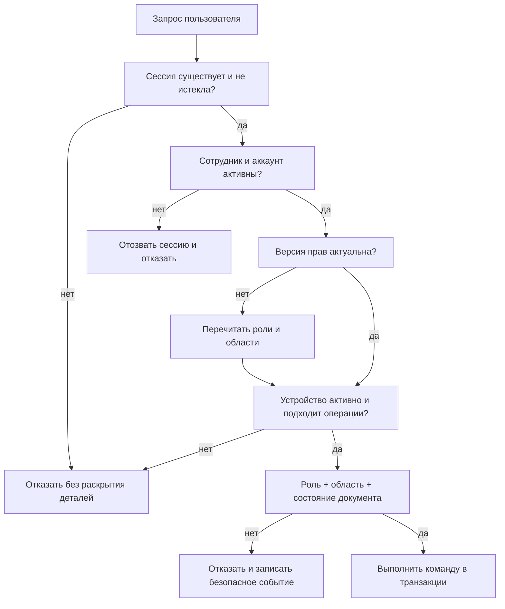

# B05. Авторизация и управление сотрудниками

Статус: проектные решения подготовлены по принятому правилу владельца
«использовать рекомендации»; реализация начинается после сведения GitHub baseline

Связанные документы:

- [модель данных и роли](DATA_MODEL.md);
- [ER-модель](ER_MODEL.md);
- [инварианты и аудит](DOMAIN_INVARIANTS.md);
- [архитектурное решение A-10](ARCHITECTURE_DECISIONS.md);
- [приемочные сценарии B05](B05_ACCEPTANCE_SCENARIOS.md).

## 1. Цель и границы

B05 создает общий контур доступа для всех последующих модулей:

- администратор заводит и архивирует сотрудников;
- сотрудник активирует выданную учетную запись;
- сервер проверяет роль и область доступа для каждого запроса;
- личный телефон привязывается только к одному сотруднику;
- фабричный iPad регистрируется как отдельный терминал;
- блокировка, увольнение и смена роли применяются немедленно;
- входы, устройства и административные изменения журналируются.

Самостоятельной регистрации, входа через социальные сети, SMS-восстановления и
общих аккаунтов цеха в MVP нет.

## 2. Решения I-01–I-10

### I-01. Идентификатор входа

Статус: `Принято по рекомендации`

Для входа используется уникальный логин, создаваемый администратором. По
умолчанию это табельный номер, если он устойчив и уникален; внутренний
`employee_id` остается случайным и наружу не раскрывается.

Сообщение об ошибке одинаково для неизвестного логина, неверного пароля и
заблокированной учетной записи, чтобы не раскрывать список сотрудников.

### I-02. Создание и первый вход

Статус: `Принято по рекомендации`

1. Администратор создает карточку сотрудника и назначает роль/область.
2. Система формирует случайный одноразовый код активации.
3. Администратор передает код сотруднику лично.
4. Код действует 24 часа, хранится только в виде защищенного хеша и
   погашается после одного использования.
5. Сотрудник задает постоянную парольную фразу и привязывает устройство.
6. До завершения активации рабочие модули недоступны.

Администратор не знает и не задает постоянный пароль сотрудника.

### I-03. Пароль

Статус: `Принято по рекомендации`

- минимум 15 символов для входа без второго фактора;
- максимум не меньше 64 символов;
- разрешены пробелы и Unicode, пароль не обрезается;
- нет искусственного требования к цифрам, регистру и спецсимволам;
- запрещаются распространенные и скомпрометированные значения;
- плановая периодическая смена не требуется;
- смена обязательна при подтвержденной или вероятной компрометации;
- хранение — только стойкий адаптивный хеш Argon2id с индивидуальной солью и
  параметрами, утвержденными нагрузочным тестом.

Пароль и его производные не попадают в аудит, логи, аналитику и клиентское
хранилище.

### I-04. Быстрый вход по PIN

Статус: `Принято по рекомендации`

Шестизначный PIN разрешен только после полноценного входа на уже привязанном
личном устройстве. Он не является удаленным паролем и не позволяет войти на
другом телефоне.

- PIN локально разблокирует защищенный ключ устройства;
- сервер не хранит и не получает PIN;
- значения `000000`, `123456`, повторяющиеся и последовательные комбинации
  запрещены;
- после 5 ошибок включается нарастающая задержка;
- после 10 последовательных ошибок локальная привязка блокируется и требуется
  полный вход/повторная привязка;
- сброс PIN требует основного пароля либо управляемого восстановления;
- биометрия/системная passkey может использоваться вместо PIN на совместимом
  Samsung, iPhone или iPad.

Конкретный способ безопасного хранения локального ключа проверяется
техническим прототипом на целевых устройствах до реализации QR-табеля.

### I-05. Одно личное устройство

Статус: `Принято владельцем`

- у сотрудника не более одного `ACTIVE` PersonalDevice;
- новая привязка возможна только после отзыва или замены прежней;
- замена выполняется администратором после очной проверки сотрудника;
- отзыв устройства немедленно отзывает связанные с ним сессии;
- удаление PWA/данных браузера не удаляет серверную запись устройства;
- восстановленная резервная копия телефона не считается автоматически
  доверенным новым устройством.

### I-06. Фабричный терминал

Статус: `Принято по рекомендации`

iPad/планшет является `FactoryTerminal`, а не общим сотрудником.

- терминал регистрируется администратором с одноразовым pairing-кодом;
- имеет имя, подразделение, место установки и статус;
- получает только технические права сканировать QR своего подразделения;
- ручная отметка требует личного входа ответственного сотрудника и причины;
- терминал нельзя использовать для производственных действий от имени
  «цеха»;
- отзыв терминала немедленно прекращает прием QR;
- выход из киоск-режима защищается отдельной административной процедурой.

### I-07. Сессии

Статус: `Принято по рекомендации`

| Контекст | Срок активного доступа | Срок возобновления | Абсолютный срок |
|---|---:|---:|---:|
| Личный телефон обычной роли | 15 минут | 7 дней, только после PIN/биометрии и доказательства ключом устройства | 30 дней |
| Администратор/руководитель/бухгалтер | 30 минут, чувствительные действия требуют повторного входа | нет фонового возобновления | 12 часов |
| Фабричный терминал, режим сканера | 24 часа, запросы подписывает ключ терминала | автоматическое обновление только активным терминалом | 30 дней |
| Личный вход ответственного на терминале | 5 минут | 15 минут | 8 часов |

Сессия хранится на сервере и может быть отозвана. Клиент получает случайный
непредсказуемый идентификатор в `Secure`, `HttpOnly`, `SameSite` cookie.
Идентификатор обновляется после входа, повышения прав и восстановления.

После 15 минут личный телефон не может продлить доступ одной только cookie:
сервер выдает challenge, а зарегистрированное устройство подписывает его
локальным ключом, разблокированным PIN/биометрией. Если целевой браузер не
позволяет реализовать защищенный ключ и надежное ограничение попыток, быстрый
PIN на нем отключается и используется полный пароль/WebAuthn. Ослаблять
проверку ради одинакового UX нельзя.

Для смены пароля, устройства, ролей, production-настроек и исправления
подтвержденной операции требуется недавняя повторная аутентификация.

### I-08. Роли и области

Статус: `Принято по рекомендации`

- сотрудник может иметь несколько активных ролей;
- каждая роль имеет область: фабрика, цех, территория, склад или магазин;
- UI скрывает недоступное действие, но окончательное решение принимает сервер;
- сервер проверяет роль, область, состояние сотрудника, состояние документа и
  принадлежность устройства при каждом запросе;
- изменение назначения увеличивает `authorization_version`;
- старая сессия не сохраняет прежние права: при следующем запросе права
  перечитываются, а при блокировке/увольнении сессия отзывается немедленно.

Матрица MVP из [DATA_MODEL.md](DATA_MODEL.md) является исходной политикой.

### I-09. Блокировка, увольнение и архив

Статус: `Принято по рекомендации`

| Действие | Employee | UserAccount | Сессии и устройства | История |
|---|---|---|---|---|
| Временная блокировка | `SUSPENDED` | `LOCKED` | все сессии отозваны, устройство сохраняется как недоверенное до разблокировки | сохраняется |
| Разблокировка | `ACTIVE` | `ACTIVE` после проверки | новый полный вход, старые сессии не оживают | сохраняется |
| Увольнение | `DISMISSED` | `DISABLED` | все сессии и устройства отозваны | сохраняется бессрочно по политике |
| Архив карточки | `ARCHIVED` | `DISABLED` | доступа нет | ссылки документов сохраняются |

Физическое удаление сотрудника, на которого ссылаются документы или аудит,
запрещено.

### I-10. Восстановление и аварийный доступ

Статус: `Принято по рекомендации`

- автоматического восстановления по контрольным вопросам нет;
- администратор очно проверяет сотрудника и выпускает одноразовый код;
- восстановление отзывает все сессии и прежнюю личную привязку;
- после задания нового пароля пользователь проходит обычную активацию
  устройства;
- операция полностью журналируется без записи кода и пароля;
- минимум два персональных администратора должны быть активны до пилота;
- система запрещает отключить последнего активного администратора или снять с
  него последнюю общезаводскую административную роль;
- аварийная учетная запись владельца хранится вне повседневного использования,
  защищается MFA/passkey и проверяется по регламенту.

## 3. Физическая модель

### Employee

- `id`, `personnel_number`, `full_name`;
- `department_id`, `employment_status`;
- `hired_at`, `dismissed_at`, `archived_at`;
- `created_at`, `updated_at`, `version`.

### UserAccount

- `id`, `employee_id`, `login_normalized`;
- `status`, `password_hash`, `password_changed_at`;
- `failed_attempt_count`, `locked_until`;
- `authorization_version`, `last_login_at`;
- `created_at`, `updated_at`, `version`.

### RoleAssignment

- `id`, `employee_id`, `role_code`;
- `scope_type`, `scope_id`;
- `valid_from`, `valid_until`;
- `created_by`, `revoked_by`, `reason`;
- периоды одной роли и области не должны конфликтовать.

### PersonalDevice

- `id`, `employee_id`, `public_key`, `device_label`;
- `platform_family`, `status`;
- `paired_at`, `last_seen_at`, `revoked_at`, `replaced_by_id`;
- уникальный индекс на одно активное устройство сотрудника.

Модель не должна собирать рекламный fingerprint телефона. Хранятся только
данные, необходимые для доверенной привязки и диагностики.

### FactoryTerminal

- `id`, `terminal_code`, `public_key`;
- `department_id`, `location_label`, `status`;
- `paired_at`, `last_seen_at`, `revoked_at`;
- pairing-секрет после привязки уничтожается.

### Session

- `id`, `account_id`, `personal_device_id` или `factory_terminal_id`;
- `token_hash`, `authorization_version`;
- `created_at`, `last_seen_at`, `access_expires_at`, `refresh_expires_at`,
  `absolute_expires_at`;
- `revoked_at`, `revoked_reason`, `rotated_from_id`.

### Activation/RecoveryToken

- `id`, `account_id`, `purpose`, `token_hash`;
- `expires_at`, `consumed_at`, `attempt_count`, `created_by`;
- только один активный токен одного назначения на аккаунт.

## 4. Серверная проверка запроса

Проверка на клиенте используется только для удобства и не считается защитой.

## 5. Защита от атак

- TLS обязателен во всех окружениях, кроме локального loopback;
- вход и восстановление имеют rate limit по аккаунту, устройству и источнику;
- задержка растет после повторных ошибок, но не позволяет массово заблокировать
  сотрудников простым перебором логинов;
- cookies недоступны JavaScript и защищены от межсайтовой отправки;
- изменяющие запросы защищены от CSRF;
- все HTML/текстовые поля экранируются;
- пароли проверяются по локальному списку распространенных/скомпрометированных
  значений без отправки открытого пароля внешнему сервису;
- административные действия требуют повторной аутентификации;
- события массовых ошибок входа, блокировки и смены устройства вызывают
  техническую тревогу;
- секреты, session ID, PIN и токены не попадают в логи.

## 6. Аудит

Обязательно записываются:

- создание, изменение статуса и архивирование сотрудника;
- выдача и погашение активации/восстановления;
- успешный вход, выход, отзыв и истечение сессии;
- серия неуспешных входов и блокировка;
- привязка, отзыв и замена личного устройства/терминала;
- назначение, изменение и отзыв роли/области;
- отказ в чувствительной операции;
- попытка отключить последнего администратора.

В записи есть actor, target, время сервера, причина, request/correlation ID,
до/после для безопасных полей и источник. Пароли, PIN, токены, cookies и
полные ключи не записываются.

## 7. Зависимости реализации

Перед написанием кода:

1. свести локальный проект и GitHub по
   [безопасному плану](REPOSITORY_BASELINE.md);
2. включить обязательный CI и защиту `main`;
3. получить модели и версии целевых Samsung, iPhone и iPad;
4. провести короткий прототип WebAuthn/локального PIN и киоск-режима;
5. подтвердить минимум двух персональных администраторов для пилота.

## 8. Основания безопасности

- [NIST SP 800-63B: требования к паролям, rate limiting и локальным activation
  secrets](https://pages.nist.gov/800-63-4/sp800-63b.html);
- [OWASP Authentication Cheat Sheet](https://cheatsheetseries.owasp.org/cheatsheets/Authentication_Cheat_Sheet.html);
- [OWASP Session Management Cheat Sheet](https://cheatsheetseries.owasp.org/cheatsheets/Session_Management_Cheat_Sheet.html);
- [OWASP Forgot Password Cheat Sheet](https://cheatsheetseries.owasp.org/cheatsheets/Forgot_Password_Cheat_Sheet.html);
- [MDN: Web Authentication API](https://developer.mozilla.org/en-US/docs/Web/API/Web_Authentication_API).
