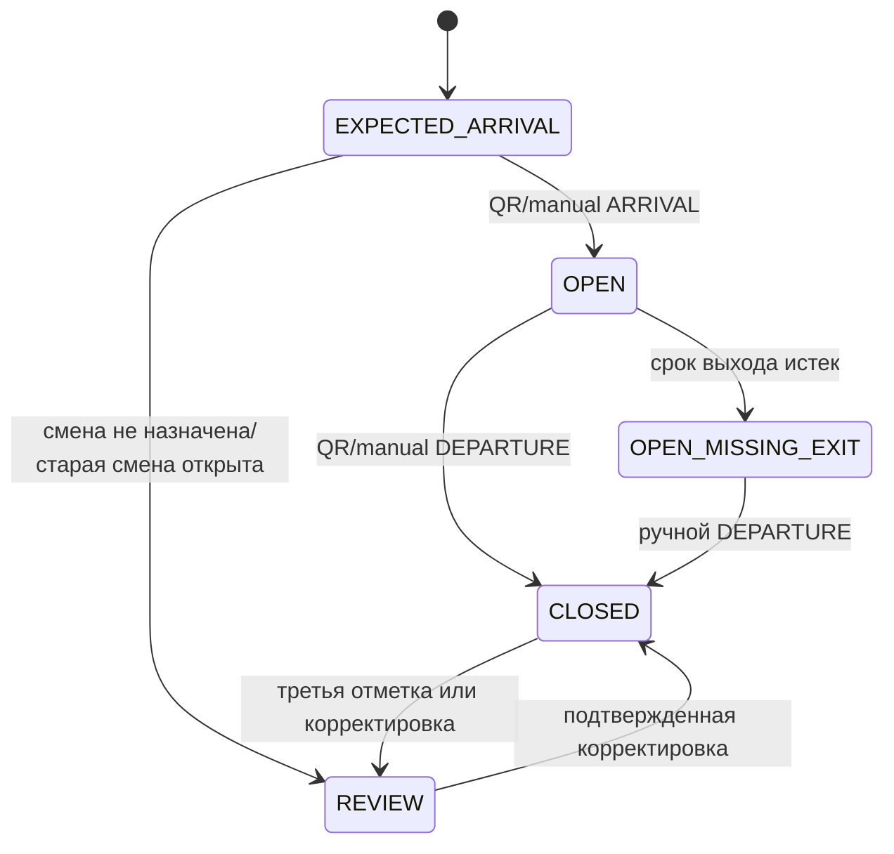

# B06. Электронный табель с динамическим QR

Статус: проектные решения подготовлены по принятому правилу владельца
«использовать рекомендации»; реализация начинается после B05 и сведения GitHub baseline

Связанные документы:

- [проект авторизации B05](B05_AUTHORIZATION_DESIGN.md);
- [модель данных и роли](DATA_MODEL.md);
- [ER-модель](ER_MODEL.md);
- [UX-сценарии](UX_SCENARIOS.md);
- [приемочные сценарии B06](B06_ACCEPTANCE_SCENARIOS.md).

## 1. Цель и границы

B06 фиксирует достоверные события прихода и ухода:

- сотрудник показывает на своем привязанном телефоне одноразовый QR;
- зарегистрированный фабричный терминал сканирует код;
- сервер определяет действие и фиксирует серверное время;
- ответственному доступна ручная отметка только с причиной;
- бухгалтер видит смены, исключения и корректировки;
- подтвержденные события не редактируются и не исчезают.

Расчет зарплаты, контроль местоположения сотрудника, распознавание лица,
биометрический учет и работа терминала полностью без связи в MVP не входят.

## 2. Решения T-01–T-12

### T-01. Расписание смен

Статус: `Принято по рекомендации`

Время смен не зашивается в код. Справочник содержит:

- название смены;
- подразделение;
- время планового начала и окончания;
- признак перехода через полночь;
- допустимое раннее открытие экрана;
- допуск опоздания;
- порог раннего ухода;
- задержку до признака `MISSING_EXIT`;
- период действия версии.

Сотрудник получает назначение смены на период. Если индивидуального назначения
нет, применяется активная смена подразделения. Если нет и ее, QR не создает
событие: система сообщает ответственному, что график не назначен.

Точные часы и допуски заполняются владельцем/ответственными перед пилотом
одного цеха. Изменение справочника не меняет уже открытые смены: `WorkShift`
хранит снимок примененного расписания.

### T-02. Бизнес-дата

Статус: `Принято по рекомендации`

- техническое время хранится как `timestamptz` в UTC;
- пользовательское время показывается в `Europe/Moscow`;
- бизнес-дата смены равна локальной дате ее планового начала;
- уход после полуночи закрывает открытую ночную смену предыдущей бизнес-даты;
- на сотрудника допускается не более одной открытой смены;
- несколько раздельных смен одного сотрудника в одну бизнес-дату — развитие
  после MVP.

### T-03. Как определяется приход или уход

Статус: `Принято по рекомендации`

Сотрудник не выбирает действие вручную:

- если открытой смены нет и смена за бизнес-день еще не закрыта — ожидается
  `ARRIVAL`;
- если есть открытая смена — ожидается `DEPARTURE`;
- если смена уже закрыта — новый QR отклоняется и предлагается обратиться к
  ответственному;
- повторное сканирование в течение 60 секунд после успешной отметки возвращает
  предыдущий результат, а не создает противоположное событие.

Телефон заранее показывает ожидаемое действие. Окончательное решение принимает
сервер внутри транзакции.

### T-04. Срок QR

Статус: `Принято владельцем`

- один QR отображается 5 секунд;
- уже отсканированный код может быть принят сервером еще в течение 3 секунд;
- максимальное окно приема — 8 секунд от серверного времени выдачи;
- время, таймер и часовой пояс телефона не влияют на приемку;
- при возврате страницы из фона старый QR не показывается — запрашивается новый;
- токен используется не более одного раза.

Клиентский `setTimeout` отвечает только за отображение. Истечение проверяет
сервер, поскольку мобильные браузеры могут задерживать таймеры фоновых вкладок.

### T-05. Содержимое QR

Статус: `Принято по рекомендации`

QR содержит только версию протокола и случайный непрозрачный секрет не менее
192 бит:

```text
tkc:a1:<base64url-random-token>
```

В QR отсутствуют ФИО, табельный номер, подразделение, роль и открытый
идентификатор сотрудника.

На сервере хранится только SHA-256-хеш высокоэнтропийного токена, а также:

- сотрудник и активное личное устройство;
- ожидаемое действие;
- версия состояния табеля сотрудника;
- время выдачи, окончания показа и окончательного истечения;
- состояние `ISSUED`, `CONSUMED`, `EXPIRED` или `REVOKED`;
- связь с принятым событием, если оно появилось.

### T-06. Защита от повторов и гонок

Статус: `Принято по рекомендации`

Каждый выданный QR связан с `attendance_state_version`. Несколько токенов могут
кратко пересекаться из-за трехсекундного допуска, но после приема одного токена
версия состояния меняется, поэтому остальные токены старой версии не могут
создать уход или второй приход.

При сканировании сервер одной транзакцией:

1. находит и блокирует токен по хешу;
2. блокирует текущий attendance-cursor сотрудника;
3. проверяет срок, одноразовость и версию состояния;
4. проверяет сотрудника, сессию, личное устройство и терминал;
5. определяет ожидаемое действие;
6. создает неизменяемый `AttendanceEvent`;
7. открывает/закрывает `WorkShift`;
8. помечает токен использованным;
9. записывает аудит и outbox;
10. подтверждает commit на надежной конфигурации БД.

Уникальные ограничения запрещают второй event для токена и вторую открытую
смену сотрудника.

### T-07. Зарегистрированный терминал вместо геолокации

Статус: `Принято по рекомендации`

В MVP геолокация телефона не запрашивается. Физическое присутствие
подтверждается сканированием на зарегистрированном `FactoryTerminal`:

- терминал активен и привязан к подразделению/месту;
- запрос подписан действующим ключом терминала;
- отозванный или неизвестный терминал получает отказ;
- терминал своего цеха принимает сотрудников этого цеха;
- общезаводской терминал возможен только как явная административная область;
- смена места или подразделения терминала журналируется.

Это уменьшает сбор персональных данных и не зависит от неточного GPS внутри
помещения.

### T-08. Поведение без сети

Статус: `Принято по рекомендации`

- телефон без связи не выдает новый QR и не показывает готовность к отметке;
- терминал без связи не показывает успешный приход/уход;
- просроченный код не ставится в очередь для поздней отправки;
- при восстановлении связи сотрудник показывает новый QR;
- если связь не восстановлена, ответственный создает ручную отметку с причиной
  `TECHNICAL_FAILURE`;
- экран явно различает «сканировано», «сервер проверяет» и «принято сервером».

Заранее выданные пакеты офлайн-токенов не входят в MVP из-за replay-риска.

### T-09. Ручная отметка

Статус: `Принято владельцем в D-03`

Ответственный цеха может поставить ручной приход/уход только:

- сотруднику своего цеха;
- за текущую бизнес-дату;
- серверным текущим временем;
- после выбора обязательной причины;
- при отсутствии конфликтующего события.

Администратор имеет ту же возможность по всей фабрике. Бухгалтер не имитирует
сканирование, а создает запрос на корректировку.

Начальный справочник причин:

- `NO_PHONE` — телефона нет с собой;
- `PHONE_DISCHARGED` — телефон разряжен;
- `DEVICE_REPLACEMENT` — устройство меняется/отозвано;
- `TECHNICAL_FAILURE` — связь, камера или терминал не работают;
- `OTHER` — только с обязательным комментарием.

Справочник версионируется. Ручной event неизменяем и заметно помечается в
табеле, контроле и выгрузке.

### T-10. Корректировка

Статус: `Принято владельцем в D-02`

Ошибочное событие не редактируется и не удаляется:

1. бухгалтер или администратор создает `AttendanceCorrection` с причиной;
2. корректировка ссылается на исходное событие/смену;
3. хранит предлагаемое эффективное время и безопасный снимок «до/после»;
4. исправление текущего незакрытого периода может подтвердить администратор;
5. исправление прошлого/закрытого периода обязательно подтверждает
   администратор после повторной аутентификации;
6. отчет использует последнюю подтвержденную цепочку корректировок, сохраняя
   исходную историю.

Ответственный цеха не меняет произвольное историческое время.

### T-11. Незакрытая смена

Статус: `Принято владельцем в D-06`

После планового окончания и настроенной задержки открытая смена получает признак
`MISSING_EXIT`. Система:

- не создает достоверный автоматический уход;
- показывает тревогу ответственному и бухгалтеру;
- утром/в начале следующего рабочего периода повторяет уведомление;
- требует ручного ухода или корректировки с причиной;
- не скрывает незакрытую смену в итоговом отчете.

Если сотрудник приходит на следующую смену с предыдущей открытой сменой, новый
приход не создается автоматически: терминал направляет его к ответственному.

### T-12. Хранение и конфиденциальность

Статус: `Принято по рекомендации`

- `AttendanceEvent`, `WorkShift`, корректировки и аудит доступны минимум год,
  затем переводятся в защищенный архив до решения бухгалтерии;
- технические записи неиспользованных QR хранятся 30 дней;
- принятый event сохраняет хеш/jti, но не исходный секрет QR;
- события отказа хранят причину и обезличенный технический контекст без
  содержимого QR;
- терминал после успеха кратко показывает ФИО, действие и время, но не историю
  табеля;
- при неизвестном, просроченном или заблокированном коде терминал не раскрывает
  ФИО;
- кадры камеры не записываются и не отправляются на сервер.

## 3. Сущности

### ShiftTemplate

- `id`, `code`, `name`, `department_id`;
- `start_local_time`, `end_local_time`, `crosses_midnight`;
- `arrival_open_minutes`, `late_grace_minutes`;
- `early_departure_threshold_minutes`, `missing_exit_delay_minutes`;
- `valid_from`, `valid_until`, `version`, `status`.

### EmployeeShiftAssignment

- `id`, `employee_id`, `shift_template_id`;
- `valid_from`, `valid_until`;
- `assigned_by`, `reason`, `created_at`.

### AttendanceCursor

- `employee_id`;
- `state_version`;
- `open_work_shift_id`;
- `last_event_id`, `last_event_at`;
- `updated_at`.

Это техническая строка сериализации конкурентных сканирований, а не источник
табеля.

### AttendanceQrToken

- `id`, `token_hash`;
- `employee_id`, `personal_device_id`, `session_id`;
- `intended_action`, `attendance_state_version`;
- `issued_at`, `visible_until`, `accept_until`;
- `status`, `consumed_at`, `attendance_event_id`.

### AttendanceEvent

- `id`, `employee_id`, `work_shift_id`;
- `event_type`: `ARRIVAL` или `DEPARTURE`;
- `capture_method`: `QR` или `MANUAL`;
- `accepted_at` — серверное время;
- `business_date`, `department_id`;
- `factory_terminal_id`, `personal_device_id`;
- `manual_reason_id`, `manual_comment`, `actor_employee_id`;
- `idempotency_key`, `correlation_id`;
- `created_at`.

### WorkShift

- `id`, `employee_id`, `business_date`;
- `status`: `OPEN` или `CLOSED`;
- `schedule_snapshot`;
- `arrival_event_id`, `departure_event_id`;
- вычисленные `worked_minutes`, `late_minutes`, `early_leave_minutes`;
- признаки `LATE`, `EARLY_LEAVE`, `MISSING_EXIT`, `MANUAL_ENTRY`,
  `CORRECTED`;
- `opened_at`, `closed_at`, `version`.

### AttendanceCorrection

- `id`, `work_shift_id`, `source_event_id`;
- `status`: `DRAFT`, `SUBMITTED`, `APPROVED`, `REJECTED`;
- `proposed_event_type`, `proposed_effective_at`;
- `reason_id`, `comment`;
- `created_by`, `decided_by`, `decided_at`;
- `before_snapshot`, `after_snapshot`, `version`.

## 4. Состояния смены



`EXPECTED_ARRIVAL`, `OPEN_MISSING_EXIT` и `REVIEW` являются вычисляемыми
состояниями интерфейса. В БД `WorkShift` остается `OPEN`/`CLOSED`, а проблемы
представлены признаками и запросами.

## 5. Экран сотрудника

Экран «Мой QR» показывает:

- ФИО сотрудника;
- ожидаемое действие «Приход» или «Уход»;
- крупный QR и контрастный обратный отсчет 5 секунд;
- состояние связи;
- последнее принятое сервером событие;
- понятный текст после успеха или отказа.

При скрытии страницы выдача токенов останавливается. При возвращении в видимое
состояние клиент сверяет с сервером состояние смены и получает новый QR.

Нельзя показывать зеленый успех только по факту, что камера прочитала код.

## 6. Экран терминала

- камера открывается только после разрешения и только через HTTPS;
- предпочтительна задняя камера (`facingMode: environment`);
- декодирование происходит локально, кадры не сохраняются;
- повтор одного кадра подавляется на клиенте, но сервер остается источником
  одноразовости;
- после чтения виден промежуточный статус «Проверяем»;
- успех показывает сотрудника, действие и серверное время на 2–3 секунды;
- ошибка имеет короткую инструкцию без раскрытия лишних данных;
- звук/вибрация дополняют цвет, но не являются единственным сигналом;
- есть кнопки смены камеры и повторного запроса разрешения;
- при невозможности камеры интерфейс ведет к ручной отметке ответственного, а
  не к вводу секрета QR руками.

Конкретный QR-декодер поставляется внутри приложения с зафиксированной версией,
без загрузки кода с внешнего CDN.

## 7. Контроль и табель

### Ответственный цеха

- кто уже пришел;
- кто ожидается;
- опоздавшие;
- незакрытые смены;
- ручные отметки своего цеха;
- ошибки терминала.

### Бухгалтер

- период, подразделение, сотрудник;
- плановое/фактическое начало и окончание;
- отработанное время;
- опоздание, ранний уход, незакрытая смена;
- ручные события и причины;
- исходное и скорректированное значение;
- статус запроса корректировки;
- экспорт передается в B19, но данные/API формируются в B06.

### Администратор

- все представления;
- терминалы и их статус;
- ручные события по фабрике;
- подтверждение корректировок;
- аудит и технические отказы.

## 8. Технические и нагрузочные цели пилота

Цели проверяются на реальном Timeweb staging и целевых устройствах:

- QR визуально готов не позднее 1 секунды после открытия экрана при нормальной
  связи;
- 95% успешных сканирований получают серверный результат не позднее 2 секунд;
- один терминал обслуживает не менее 30 последовательных отметок за 5 минут без
  перезагрузки страницы;
- нагрузочный тест моделирует 70 сотрудников, одновременно обновляющих QR, и
  не менее трех терминалов;
- повтор, просроченный токен и два параллельных сканирования не создают второй
  event;
- потеря ответа после commit и повтор запроса возвращают исходный результат;
- отзыв терминала/сотрудника применяется к следующему запросу.

Эти значения являются приемочными целями, а не обещанием без измерений.

## 9. Технический прототип до реализации

На конкретных Samsung, iPhone и iPad проверить:

1. разрешение камеры и выбор задней камеры;
2. скорость чтения QR при обычном и слабом освещении;
3. минимальный удобный физический размер QR;
4. поведение PWA после блокировки экрана и возврата из фона;
5. задержку Wi‑Fi/мобильной сети в точке табеля;
6. киоск-режим iPad и невозможность случайного выхода;
7. звук/вибрацию и читаемость результата;
8. очередь из реальных сотрудников без подсказок.

Если трехсекундного допуска недостаточно по измерениям, изменение протокола
выносится владельцу отдельно; окно нельзя молча расширять.

## 10. Основания веб-платформы

- [MDN: камера через getUserMedia требует HTTPS и разрешение
  пользователя](https://developer.mozilla.org/en-US/docs/Web/API/MediaDevices/getUserMedia);
- [MDN: Page Visibility API для остановки работы скрытой
  страницы](https://developer.mozilla.org/en-US/blog/using-the-page-visibility-api/);
- [MDN: мобильные браузеры могут задерживать таймеры фоновых
  вкладок](https://developer.mozilla.org/en-US/docs/Web/API/Window/setTimeout#timeouts_in_inactive_tabs).
