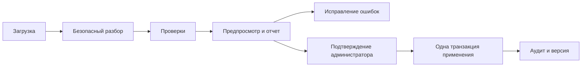

# B07. Справочники и массовый импорт товаров/норм

Статус: проектные решения и шаблон v1.0 подготовлены; реализация ожидает
B05, GitHub baseline и утверждение таблицы соответствий

Связанные материалы:

- [профиль исходной книги](B07_SOURCE_WORKBOOK_PROFILE.md);
- [модель данных](DATA_MODEL.md);
- [приемочные сценарии B07](B07_ACCEPTANCE_SCENARIOS.md);
- [шаблон импорта](../templates/import/README.md).

## 1. Цель и границы

B07 создает:

- управляемые справочники товаров, категорий, цехов, штрихкодов, причин, смен и
  календаря;
- безопасную массовую загрузку товаров и недельных норм;
- предпросмотр без изменения production;
- понятный отчет ошибок/предупреждений;
- отдельный одноразовый преобразователь старой книги;
- неизменяемый аудит примененного импорта.

Полуфабрикаты, сотрудники из старой книги, адреса торговых точек, зарплаты,
производственный факт и распределение нормы по магазинам не импортируются.

## 2. Решения I07-01–I07-10

### I07-01. Источник идентичности товара

Статус: `Принято по рекомендации`

- внутренний `product_id` генерирует система;
- стабильный `product_code` обязателен и уникален;
- для первой миграции предлагаются коды `TKF-00001`, `TKF-00002` и далее;
- владелец утверждает связь кода с исходным названием;
- после применения товар обновляется только по коду, не по названию;
- `external_code` для будущей 1С/Agent Plus необязателен и не заменяет
  внутренний код;
- название можно исправлять без потери истории.

Автоматическое fuzzy-слияние похожих названий запрещено.

### I07-02. Штрихкод

Статус: `Принято по рекомендации`

- один активный штрихкод относится к одному виду товара;
- товар может иметь несколько исторических/активных штрихкодов;
- штрихкод хранится как строка без числового преобразования;
- пробелы по краям удаляются, внутреннее значение не меняется;
- дубликат — ошибка;
- известные EAN-8/13/14 проверяются по контрольной цифре;
- иной формат допускается после предупреждения, если сканируется фактическим
  оборудованием.

Отсутствие штрихкода не блокирует создание товара, но блокирует сценарий
сканирования до заполнения.

### I07-03. Нормализованный шаблон

Статус: `Принято по рекомендации`

Шаблон v1.0 содержит только:

- `Инструкция`;
- `Товары`;
- `Нормы`;
- `Справочники`.

Строка нормы:

```text
территория + день вывоза + код товара + количество + дата начала + дата окончания
```

День относится к вывозу, не к производству. Производственная дата вычисляется
планировщиком B09 по календарю и исключениям.

### I07-04. Нулевые позиции

Статус: `Принято по рекомендации`

Ноль является допустимым входом, но активная строка `NormTemplate` для него не
создается. В отчете строка получает `SKIPPED_ZERO`.

Пустое количество не равно нулю и является ошибкой `REQUIRED_VALUE`.

### I07-05. Дубликаты

Статус: `Принято по рекомендации`

В нормализованном шаблоне дубликат ключа
`территория + день + товар + дата начала` является ошибкой. Система не
угадывает, нужно суммировать или выбрать последнее значение.

Одноразовый преобразователь старой книги является исключением: два явно
обнаруженных пятничных блока территории 9 агрегируются до формирования
нормализованного файла, а все исходные строки остаются в lineage-отчете.

### I07-06. Дата действия

Статус: `Принято по рекомендации`

- дата начала обязательна;
- все строки одной стартовой загрузки должны иметь одну дату начала;
- дата окончания необязательна;
- при публикации новая версия закрывает предыдущую накануне даты начала;
- пересечение с уже утвержденной будущей версией — ошибка, требующая отдельной
  административной замены;
- дата первой миграции вводится владельцем, а не выводится из имени файла.

### I07-07. Предпросмотр и атомарность

Статус: `Принято по рекомендации`

Загрузка никогда не меняет справочники сразу:



Если хотя бы одна строка имеет ошибку, применение запрещено. Предупреждения
показываются отдельно и требуют явного подтверждения.

Товары применяются перед нормами внутри одной транзакции. Ошибка любой части
откатывает весь batch.

### I07-08. Идемпотентность

Статус: `Принято по рекомендации`

Для файла вычисляется SHA-256. Комбинация
`тип импорта + хеш файла + версия шаблона + дата начала` уникальна.

- повторная загрузка возвращает существующий результат;
- повторное подтверждение `APPLIED` batch не создает версии повторно;
- измененный файл создает новый batch;
- отмененный/исправленный импорт выполняется новой компенсирующей версией, а
  не удалением аудита.

### I07-09. Безопасность файла

Статус: `Принято по рекомендации`

- принимается только `.xlsx` установленного лимита;
- `.xlsm`, макросы, исполняемые вложения и внешние ссылки отклоняются;
- формулы в рабочих строках отклоняются;
- скрытые листы с данными отклоняются;
- заголовки и версия шаблона проверяются точно;
- архив распаковывается с лимитами размера/числа файлов;
- исходное имя очищается и не используется как путь;
- обработка идет в изолированном worker;
- пользователь не видит внутренние stack trace;
- экспорт ошибок защищается от formula injection.

Рекомендуемый начальный лимит — 10 МБ и 100 000 строк; он проверяется
нагрузочным тестом.

### I07-10. Хранение

Статус: `Принято по рекомендации`

- batch, строки, ошибки, решение и хеш хранятся в аудите минимум год;
- нормализованный загруженный файл хранится в приватном S3 90 дней, затем
  остается хеш и отчет;
- исходная старая книга с персональными данными не копируется в Git и не
  хранится как обычное вложение production;
- одноразовый преобразователь запускается в защищенном migration-окружении и
  сохраняет только разрешенные нормализованные результаты.

## 3. Состояния импорта

```text
UPLOADED
  → PARSING
  → VALIDATING
  → INVALID | READY_WITH_WARNINGS | READY
  → APPLYING
  → APPLIED | FAILED
```

Дополнительно batch может быть `REJECTED` администратором или `SUPERSEDED`
новой версией. `APPLIED` не возвращается в редактируемое состояние.

## 4. Сущности

### ImportBatch

- `id`, `import_type`, `template_version`;
- `original_file_name`, `file_size`, `file_sha256`, `s3_object_key`;
- `effective_from`, `status`;
- `total_rows`, `valid_rows`, `warning_rows`, `error_rows`, `skipped_rows`;
- `uploaded_by`, `confirmed_by`, `created_at`, `applied_at`;
- `idempotency_key`, `correlation_id`, `version`.

### ImportRow

- `id`, `batch_id`, `sheet_name`, `source_row_number`;
- `entity_type`, `natural_key`;
- `raw_snapshot`, `normalized_snapshot`;
- `status`: `VALID`, `WARNING`, `ERROR`, `SKIPPED_ZERO`, `APPLIED`;
- `target_entity_id`.

Снимки проходят фильтрацию и не должны содержать поля вне разрешенной схемы.

### ImportIssue

- `id`, `row_id` или `batch_id`;
- `severity`: `ERROR` или `WARNING`;
- `code`, `column_name`;
- `safe_value_preview`, `message`, `suggested_fix`;
- `created_at`.

### ProductMappingCandidate

- `id`, `batch_id`;
- `source_name`, `normalized_source_name`;
- `proposed_product_code`, `proposed_category`;
- `approved_product_id`, `decision`, `decided_by`, `decided_at`;

Используется только для первой миграции и не становится механизмом нечеткого
матчинга всех будущих импортов.

## 5. Проверки

### Файл

- тип, размер, структура ZIP/XLSX;
- разрешенные листы и точная версия;
- отсутствие макросов, внешних ссылок, формул и скрытых данных.

### Строка товара

- обязательный код, название, категория, единица, активность;
- уникальный код и штрихкод;
- допустимая длина и формат;
- существующий цех либо предупреждение о необходимости назначения.

### Строка нормы

- территория — целое 1–9;
- день — значение справочника;
- товар существует в БД или в том же batch;
- количество — целое 0–100 000;
- дата начала обязательна;
- дата окончания не раньше начала.

### Межстрочные и бизнес-проверки

- нет дубликата ключа;
- одна дата начала в batch;
- нет запрещенного пересечения версий;
- пятничная норма вне территории 9 — предупреждение высокого уровня;
- товар без цеха/штрихкода — предупреждение;
- архивный товар не активируется автоматически;
- итог числа применяемых строк сходится с предпросмотром.

## 6. Одноразовый преобразователь исходной книги

1. Проверить контрольную сумму файла.
2. Разрешить только шесть текущих листов норм.
3. Найти заголовки территорий регулярным правилом, а не номерами строк.
4. Прочитать пары A/B и D/E до следующего заголовка.
5. Отделить 81 товарную позицию от итогов, категорий и подписей.
6. Прочитать день вывоза из заголовка блока.
7. Сохранить source lineage: лист, строка, территория, вариант.
8. Сгруппировать два пятничных блока территории 9.
9. Пропустить нули с отчетом; остановиться на семи пустых количествах.
10. Сформировать 81 кандидат сопоставления.
11. После решения владельца выпустить нормализованный файл v1.0.
12. Загрузить его обычным процессом предпросмотра и подтверждения.

Листы архива и смешанные листы не используются как источник активных данных.

## 7. Результат предпросмотра

Администратор видит:

- имя и хеш файла;
- версию шаблона и дату начала;
- сколько товаров будет создано/обновлено/пропущено;
- сколько норм будет создано/закрыто/пропущено как ноль;
- ошибки и предупреждения с листом/строкой/колонкой;
- расхождения каталога;
- агрегирование территории 9;
- итоговые количества по территории и дню;
- кнопку выгрузки отчета ошибок;
- подтверждение с повторной аутентификацией.

## 8. Что осталось согласовать данными

Проектное правило уже выбрано; перед применением нужны конкретные значения:

- дата начала первой версии;
- утвержденные коды и категории 81 товара;
- штрихкоды;
- основной цех каждого товара;
- исправления семи пустых количеств.

Эти данные не блокируют разработку валидатора и предпросмотра, но блокируют
production-применение.
