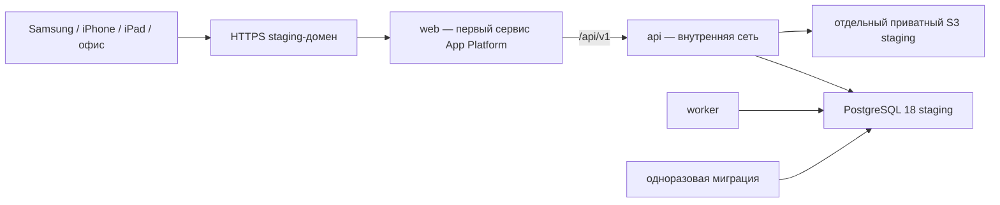

# B20.2. Развёртывание и проверка staging в Timeweb

Статус: staging развёрнут 02.08.2026, приложение и PostgreSQL переведены в одну
приватную сеть, публичный доступ к БД отключён, итоговый smoke пройден;
авторизованная нагрузка, целевые устройства, recovery drill, независимая проверка
и подпись UAT ещё не выполнены. Факты и открытые ворота собраны в
[доказательствах staging](B20_2_STAGING_EVIDENCE.md).

## 1. Граница этого среза

Этот документ доводит staging до повторяемой процедуры. В репозитории есть:

- корневой `docker-compose.yml` для Timeweb App Platform;
- единая сборка `Dockerfile.app` для web, API, worker и миграции: каждый сервис
  объявляет одинаковый build, а BuildKit разделяет слои и выполняет тяжёлые шаги
  один раз последовательно;
- один публичный HTTPS origin: web проксирует `/api/v1/*` во внутренний API;
- обязательная миграция перед запуском API и worker;
- public smoke, нагрузочный профиль и ручной GitHub workflow `Staging gates`;
- контрольный manifest подтверждённых операций для восстановления БД.

Продукты, нормы и сотрудники не загружаются: по решению владельца это B22.
Тестовые данные B20.2 должны быть синтетическими или обезличенными.

## 2. Принятая staging-схема



App Platform проксирует основной домен только на первый сервис Compose, поэтому
`web` должен оставаться первым. В staging нет локальных volumes: PostgreSQL и S3
внешние и не смешиваются с production.

Все четыре сервиса запускаются из одинаковой сборки с разными командами. Build
объявлен у каждого сервиса, поэтому Timeweb пересобирает выбранный commit, а не
переиспользует устаревший локальный тег. Одинаковый Dockerfile и аргументы дают
BuildKit общий кэш: зависимости, TypeScript и Next.js фактически собираются один
раз, после чего готовые слои экспортируются сервисам.

Это упрощённый staging. Он проверяет приложение, миграции, устройства, нагрузку и
восстановление. Он не доказывает production RPO 0: Timeweb документирует
асинхронную leader-replica репликацию DBaaS. До production требуется письменное
подтверждение синхронного commit от Timeweb либо собственный синхронный кластер.

## 3. Создание ресурсов владельцем Timeweb

До оплаты записать выбранный тариф и месячный лимит в журнал решения.

1. Создать отдельный проект `tashkalinskaya-staging` и приватную сеть.
2. Создать PostgreSQL 18 staging в этой сети; публичный доступ выключить.
3. Включить ежедневные физические копии и срок хранения по принятой политике.
4. Создать отдельный приватный S3-бакет без public listing/access.
5. Заранее закрепить staging-домен. После смены RP ID устройства WebAuthn нужно
   регистрировать заново, поэтому технический временный домен для приёмки не
   использовать.
6. В App Platform выбрать Docker Compose, подключить
   `movsark/tashkalinskaya-control`, выключить автодеплой и выбрать точный commit
   из `main`.
7. Подключить приложение к той же приватной сети и задать переменные раздела 4.

Создание платных ресурсов и их удаление фиксируются владельцем аккаунта.

## 4. Переменные Timeweb

| Имя | Правило |
|---|---|
| `APP_VERSION` | полный SHA выбранного commit |
| `PUBLIC_ORIGIN` | `https://staging.example.ru`, без завершающего `/` |
| `WEBAUTHN_RP_ID` | только hostname staging-домена |
| `DATABASE_URL` | отдельный пользователь staging, TLS, без public-доступа |
| `DATABASE_MAX_CONNECTIONS` | лимит пула API; по умолчанию `10`, менять только измеряемым нагрузочным экспериментом |
| `AUTH_TOKEN_PEPPER` | отдельное случайное значение не короче 32 символов |
| `SESSION_TOKEN_PEPPER` | отдельное случайное значение не короче 32 символов |
| `CSRF_SECRET` | отдельное случайное значение не короче 32 символов |
| `PUSH_SUBSCRIPTION_ENCRYPTION_KEY` | отдельное случайное значение от 32 символов |
| `PUSH_VAPID_PUBLIC_KEY` | публичная часть пары staging |
| `PUSH_VAPID_PRIVATE_KEY` | приватная часть пары staging |
| `PUSH_VAPID_SUBJECT` | рабочий `mailto:` владельца push |
| `S3_ENDPOINT`, `S3_REGION`, `S3_BUCKET` | отдельный staging-бакет |
| `S3_ACCESS_KEY_ID`, `S3_SECRET_ACCESS_KEY` | ключ только нужного бакета |

Для создания первого синтетического администратора job `bootstrap-admin`
включается только на один деплой следующими временными переменными:

- `BOOTSTRAP_ADMIN_ENABLED=true`;
- `BOOTSTRAP_ADMIN_FULL_NAME`, `BOOTSTRAP_ADMIN_LOGIN` и
  `BOOTSTRAP_ADMIN_PERSONNEL_NUMBER` — только синтетические значения;
- `BOOTSTRAP_ADMIN_ACTIVATION_CODE` — случайный одноразовый secret.

Job работает внутри VPC, после миграции и до запуска API. Если флаг не равен
`true`, job завершается без обращения к данным. После успешной активации флаг и
четыре временные переменные удаляются из Timeweb, затем выполняется контрольный
деплой. Код активации не попадает в чат, репозиторий, отчёт или GitHub Actions.

Pepper и CSRF-ключи генерируются независимо. Значения не отправляются в чат, PR,
логи или скриншоты. Доступ к панели — персональный и с MFA.

## 5. Первый запуск

1. Убедиться, что job `migrate` завершился кодом 0.
2. Проверить, что `api`, `worker` и `web` запущены, API readiness — healthy.
3. Сверить `version` в `/api/v1/health/live` с `APP_VERSION`.
4. Проверить TLS и отсутствие публичного порта PostgreSQL.
5. Создать только тестового администратора приватным `bootstrap-admin` job,
   активировать его на выделенном устройстве и удалить временные переменные.
6. Не регистрировать реальные устройства до закрепления staging-домена.

## 6. GitHub gate

В GitHub создать Environment `staging` с ручным подтверждением владельца:

- variable `STAGING_BASE_URL` — HTTPS origin staging;
- secret `STAGING_READ_TOKEN` — отдельный случайный ключ только для
  read-нагрузки.

В Timeweb для API задаются `STAGING_LOAD_AUTH_ENABLED=true`,
`STAGING_LOAD_LOGIN=<логин синтетического администратора>` и
`STAGING_LOAD_TOKEN_SHA256=<SHA-256 отпечаток ключа>`. Исходный ключ в Timeweb
не хранится. Механизм запускается только при `NODE_ENV=staging`; `POST`, `PUT`,
`PATCH` и `DELETE` с этим ключом запрещены до выполнения бизнес-логики.

Workflow `Staging gates` запускается вручную. `expected_version` — точный SHA,
который развернут как `APP_VERSION`. Public smoke проверяет:

- web, manifest и service worker;
- live/ready API и доступность PostgreSQL;
- совпадение версии;
- same-origin CORS и security headers;
- `401` без сессии и `403` для hostile Origin.

Нагрузку включать только после наполнения синтетическим объёмом. Профиль выполняет
70 параллельных пользователей и допускает p95 не более 1 секунды, ошибок не более
1%. Ключ не выводится инструментом в отчёт.

## 7. Recovery drill

Manifest содержит только checksum и количества; строки БД и URL подключения в
файл не попадают. Сам файл — защищаемое доказательство, не commit в Git.

После остановки меняющего трафика и worker, перед контрольной копией:

```bash
RECOVERY_DATABASE_URL='...' RECOVERY_DATABASE_SSL=require \
  RECOVERY_DATABASE_TLS_SHA256='AA:BB:...' \
  npm run test:recovery:capture -- --output var/recovery/baseline.json
```

После восстановления копии в новый изолированный кластер:

```bash
RECOVERY_DATABASE_URL='...' RECOVERY_DATABASE_SSL=require \
  RECOVERY_DATABASE_TLS_SHA256='AA:BB:...' \
  npm run test:recovery:verify -- --input var/recovery/baseline.json
```

Приватный IP Managed PostgreSQL Timeweb не показывает корневой сертификат для
скачивания в панели управления. Поэтому соединение остаётся зашифрованным TLS, а
приложение сверяет SHA-256 отпечаток фактического сертификата при создании каждого
соединения. Отпечаток staging закреплён как `DATABASE_TLS_SHA256` в манифесте
App Platform; публичный доступ к БД для этого не требуется.
Параметры `sslmode` из `DATABASE_URL` удаляются внутри database-пакета, чтобы
`pg-connection-string` не перезаписал эту явно заданную политику TLS.
При пересоздании кластера или ротации сертификата новый fingerprint сначала
сверяется по внутреннему журналу TLS и затем обновляется в манифесте. Для
изолированного кластера восстановления его собственный отпечаток передаётся через
`RECOVERY_DATABASE_TLS_SHA256`. Проверка восстановления требует
полного совпадения миграций и критичных
таблиц, а также нулевых расхождений ledger/stock balance. Затем выполняется полный
[протокол восстановления](B20_RECOVERY_PROTOCOL.md) с фиксацией T0/T1.

## 8. Ручные доказательства B20.2

| Проверка | Кто подтверждает | Доказательство |
|---|---|---|
| Samsung: установка PWA, WebAuthn, QR, push | сотрудник пилотного цеха | модель/ОС, результат, дефект |
| iPhone: установка PWA, WebAuthn, QR, push | назначенный сотрудник | модель/iOS, результат, дефект |
| iPad: терминал, камера, повторный вход | ответственный цеха | модель/iPadOS, результат, дефект |
| Office: отчёт, печать, XLSX/PDF | руководитель/бухгалтер | браузер, принтер, результат |
| Recovery drill | владелец Timeweb + исполнитель | T0/T1, manifest, подписанный протокол |
| UAT ролей | владельцы процессов | заполненный B20 UAT checklist |

В B21 нельзя переходить при открытом P0/P1, несовпадении версии, неуспешном
recovery или неподписанном UAT.

## 9. Актуальные основания Timeweb

- [Docker Compose в App Platform](https://timeweb.cloud/docs/apps/deploying-with-docker-compose);
- [приватная сеть App Platform выбирается до первого деплоя](https://timeweb.cloud/docs/apps/deploying-backend-applications);
- [PostgreSQL и асинхронная репликация](https://timeweb.cloud/docs/dbaas/postgresql);
- [физические резервные копии](https://timeweb.cloud/docs/dbaas/dbaas-manage/backup);
- [Terraform Timeweb](https://timeweb.cloud/docs/terraform).

Документация проверена 1 августа 2026 года. Перед оплатой тарифы и доступность
зон проверяются повторно.
