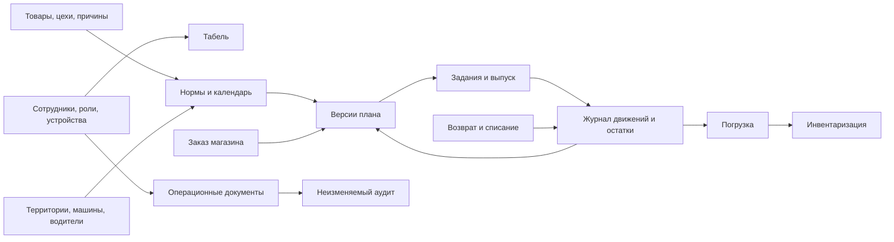

# B02. Утвержденная модель данных, роли и статусы

Статус: D-01…D-08 утверждены владельцем; D-09…D-10 приняты как рекомендуемые проектные правила 30.07.2026

Дата: 30.07.2026

Основание: ТЗ 0.1, дорожная карта и утвержденные ADR B01

Ограничение: это логическая модель; SQL-схема, миграции и код приложения не создавались

## 1. Цель

Создать единую модель, в которой можно объяснить происхождение каждого плана, выпуска, остатка, возврата, списания и табельной отметки.

Основные правила:

- подтвержденные операции не редактируются задним числом;
- исправление создает новую компенсирующую запись;
- бизнес-дата хранится отдельно от точного серверного времени;
- производственная дата и дата вывоза различаются;
- количество на складе выводится из журнала движений;
- роль отделена от сотрудника и может иметь область действия;
- критичная команда имеет ключ идемпотентности;
- каждая версия плана и нормы воспроизводима;
- внешние коды 1С/Agent Plus не являются внутренними идентификаторами.

## 2. Общая карта модулей данных

## 3. Общие технические поля

Каждая изменяемая сущность получает:

- внутренний непрозрачный идентификатор;
- `created_at` и `updated_at` по серверному времени;
- номер версии для защиты от параллельной перезаписи;
- автора создания и последнего изменения;
- признак архивирования вместо физического удаления;
- при необходимости — бизнес-дату по `Europe/Moscow`.

Каждая критичная команда дополнительно получает:

- ключ идемпотентности;
- идентификатор пользовательской сессии и устройства;
- correlation ID для связи бизнес-записи, аудита и уведомлений;
- обязательную причину для ручного исключения или исправления.

## 4. Сотрудники, роли и устройства

### Основные сущности

- `Employee` — сотрудник, ФИО, табельный номер, подразделение, состояние занятости.
- `UserAccount` — способ входа, состояние учетной записи, время последнего входа.
- `Role` — системная роль.
- `RoleAssignment` — назначение роли сотруднику с датой начала/окончания.
- `AccessScope` — область роли: вся фабрика, конкретный цех, территория или магазин.
- `PersonalDevice` — единственное активное личное устройство сотрудника.
- `FactoryTerminal` — зарегистрированный iPad/планшет фабрики с назначением и местом.
- `Session` — серверная сессия, устройство, срок и отзыв.

### Состояния

`Employee`: `ACTIVE`, `SUSPENDED`, `DISMISSED`, `ARCHIVED`.

`UserAccount`: `INVITED`, `ACTIVE`, `LOCKED`, `DISABLED`.

`PersonalDevice` и `FactoryTerminal`: `PENDING`, `ACTIVE`, `REVOKED`, `REPLACED`.

Удаление сотрудника не допускается, если на него ссылаются документы. Увольнение закрывает доступ, но сохраняет историю.

## 5. Матрица ролей MVP

Обозначения: `У` — управляет, `В` — вводит/выполняет, `П` — подтверждает, `Ч` — только читает, `—` — доступа нет.

| Область | Администратор | Руководитель | Бухгалтер | Ответственный цеха | Кондитер | Кладовщик | Водитель | Продавец | Только табель |
|---|---:|---:|---:|---:|---:|---:|---:|---:|---:|
| Сотрудники, роли, устройства | У | Ч | Ч | Ч своего цеха | — | — | — | — | — |
| Аналитика и контрольный экран | У | Ч | Ч табеля | Ч своего цеха | — | Ч склада | Ч своей территории | Ч своих заказов | — |
| Табель и QR | У | Ч | У/Ч | В ручной отметки своего цеха | В QR | В QR | В QR | В QR | В QR |
| Справочники | У | Ч | — | Ч | Ч | Ч | Ч | Ч | — |
| Нормы | У/П | Ч | — | Ч | — | Ч | В предложения своей территории | — | — |
| Производственный план | У/П | Ч | — | Ч своего цеха | Ч своих заданий | Ч | Ч своей территории | Ч заказа | — |
| Задания и выпуск | У | Ч | — | У/П своего цеха | В | Ч/П приемки | — | — | — |
| Склад и инвентаризация | У | Ч | — | Ч передач | — | У/В/П | Ч своей погрузки | Ч выдачи магазину | — |
| Погрузка | У | Ч | — | — | — | В/П | П/отклонение | — | — |
| Возврат и списание | У/П | Ч | — | Ч брака цеха | В брака | В/П приема | В передачи | — | — |
| Отчеты/выгрузки | У | Ч | Ч табеля | Ч своего цеха | — | Ч склада | Ч своей территории | Ч своих заказов | — |
| Аудит | Ч | Ч | Ч табеля | Ч своего цеха | — | Ч своих операций | Ч своих операций | Ч своих операций | — |

Матрица задает начальную границу. Администратор не должен незаметно переписывать подтвержденные данные: его исправление также является отдельной операцией с причиной.

## 6. Табель

### Сущности

- `AttendanceQrToken` — одноразовый короткоживущий токен без ФИО.
- `AttendanceEvent` — приход, уход или ручная отметка.
- `WorkShift` — вычисленная смена сотрудника за бизнес-день.
- `AttendanceCorrection` — исправление с причиной и ссылкой на исходное событие.
- `ManualAttendanceReason` — справочник причин отсутствия телефона или иной ручной операции.

### Состояния смены

`OPEN` → `CLOSED`.

Дополнительные признаки: `LATE`, `MISSING_EXIT`, `MANUAL_ENTRY`, `CORRECTED`.

QR-событие хранит сотрудника, терминал, серверное время, тип события, токен и результат проверки. Повторное использование токена не создает событие.

## 7. Справочники

- `Product` — вид торта/товара, наименование, единица учета, активность.
- `ProductBarcode` — штрихкод вида товара; в MVP это не серийный номер коробки.
- `Workshop` — цех.
- `WorkshopProductAssignment` — обычное или временное закрепление товара за цехом.
- `ReasonCode` — версионируемые причины ручной отметки, невыполнения, брака, отклонения и списания.
- `ExternalCodeMapping` — будущие коды 1С/Agent Plus.
- `ImportBatch`, `ImportRow`, `ImportError` — staging и протокол массового импорта.

Справочник не удаляется, если использован в документе. Изменение названия не меняет историческое отображение: критичный документ хранит снимок наименования и кода.

## 8. Территории и логистика

- `Territory` — постоянная маршрутная единица с кодом 1–9 и настраиваемым
  названием.
- `Vehicle` — машина с уникальным нормализованным регистрационным номером и
  признаком активности.
- `DriverProfile` — связь активного сотрудника с ролью водителя.
- `TerritoryDefaultAssignment` — версионируемый период основного водителя и
  основной машины территории.
- `TerritoryRun` — фактический выход на дату: территория, номер рейса, водитель
  дня, машина дня, интервал и группа.
- `LoadingGroup` — датированная группа погрузки из одного–четырех рейсов,
  обычно из трех.
- `RunAssignmentChange` — неизменяемая история замены назначения.

История закреплений сохраняется по периодам действия. Замена водителя или
машины дня не меняет основного закрепления.

Ключ рейса: `дата вывоза + территория + номер рейса`. Один рейс имеет одного
активного водителя и одну машину. Интервалы активных рейсов одного водителя или
машины не пересекаются и учитывают настраиваемый буфер.

Состояния рейса:

`DRAFT` → `SCHEDULED` → `READY_FOR_LOADING` → `LOADING` → `COMPLETED`.

До завершения возможен `CANCELLED` с причиной. После первой строки погрузки
прямое переназначение запрещено; применяется аварийный регламент с сохранением
подтвержденных операций.

## 9. Календарь, нормы и магазин

### Сущности

- `CalendarVersion` — опубликованная версия производственного и вывозного
  календаря.
- `ProductionCalendarDay` — рабочий/нерабочий день производства.
- `DispatchCalendarDay` — рабочий/нерабочий день вывоза по области.
- `ProductionDispatchLink` — однозначная связь даты вывоза с датой производства.
- `CalendarException` — праздник или внеплановое исключение с областью.
- `NormTemplateVersion` — территория, день недели вывоза, товар, количество и
  период действия.
- `NormChangeRequest` и строки — постоянное или разовое предложение водителя.
- `OneOffNormOverride` — утвержденное абсолютное значение на одну дату вывоза.
- `PlanningCutoff` — серверная отсечка 10:00 для производственной даты.
- `StoreOrder` и `StoreOrderLine` — заказ магазина сегодня на завтра.

`CalendarException` может связать производство в среду с пятничным маршрутом
территории 9, не открывая пятницу для других территорий.

### Состояния изменения нормы

`DRAFT` → `SUBMITTED` → `APPROVED`, `REJECTED`, `RETURNED`, `STALE` или
`MISSED_CUTOFF`.

После наступления периода действия: `EFFECTIVE` → `SUPERSEDED`.

Постоянное изменение создает новую версию шаблона с датой начала. Разовое
абсолютное значение заменяет постоянное только на одной дате вывоза. Значения
не складываются. Историческая версия не переписывается.

### Состояния заказа магазина

`DRAFT` → `SUBMITTED` → `LOCKED` → `INCLUDED_IN_PLAN`.

До 10:00 продавец может менять черновик. После блокировки исправление выполняет администратор отдельной версией.

## 10. Производственный план

- `PlanRun` и `PlanRunAttempt` — идемпотентный логический запуск и его попытки.
- `PlanInputSnapshot` — неизменяемые версии норм, календаря, заказа, остатков и
  распределений.
- `PlanDemandLine` — расчет направления с полным происхождением потребности.
- `ProductionPlan` — версия плана.
- `ProductionPlanLine` — товар, цех, количество и происхождение потребности.
- `StockAllocation` — ручное назначение свободного остатка кладовщиком или администратором.
- `PlanOverride` — административное изменение опубликованного плана.

### Состояния

Запуск: `QUEUED` → `PREFLIGHT` → `CALCULATING` → `PUBLISHED`.

Ошибочный запуск: `FAILED`, после чего допускается безопасная новая попытка
того же логического запуска.

Изменение опубликованного плана не перезаписывает его: создается новая версия
`PUBLISHED`, а прежняя становится `SUPERSEDED`.

Каждая строка объясняет расчет:

- норма;
- утвержденное изменение;
- заказ магазина;
- назначенный свободный остаток;
- возвратный пул;
- административная корректировка.

Расчет выполняется только из snapshot. Одинаковые snapshot, производственная
дата и версия движка обязаны давать одинаковые строки и контрольный хеш.

## 11. Производство

- `ProductionTask` — задание цеху/кондитеру.
- `ProductionTaskAssignment` — исполнитель и назначенное количество.
- `ProductionBatch` — заявленный выпуск партии.
- `ProductionShortfall` — невыполнение с причиной.
- `DefectReport` — производственный брак, количество, причина и фото.
- `WarehouseReceipt` — подтверждение партии кладовщиком.

### Состояния задания

`CREATED` → `ASSIGNED` → `IN_PROGRESS` → `COMPLETED` или `PARTIALLY_COMPLETED`.

Отмена: `CANCELLED_BY_ADMIN` с обязательной причиной.

### Состояния партии

`DECLARED` → `ACCEPTED_BY_WAREHOUSE` или `REJECTED_FOR_CORRECTION`.

До приемки выпуск может быть отозван автором с причиной. Отклоненная партия возвращается в цех на исправление и повторную подачу. После приемки партия не редактируется; исправление проходит через администратора компенсирующим складским движением.

Ночная партия «Наполеонов» хранит фактическое время выпуска и отдельное время утренней приемки.

## 12. Склад

### Учетные корзины

- `PENDING_RECEIPT` — ожидает приемки;
- `FREE_STOCK` — свободный склад;
- `RESERVED_FOR_LOADING` — зарезервировано погрузкой;
- `RETURN_POOL` — общий пул годного возврата;
- `BLOCKED_FOR_WRITEOFF` — заблокировано заявкой;
- `WRITTEN_OFF` — списано;
- `PRODUCTION_DEFECT` — производственный брак.

### Сущности

- `StockMovement` — неизменяемая строка движения между корзинами.
- `StockMovementDocument` — бизнес-основание группы движений.
- `StockBalance` — быстрое представление остатка, сверяемое с журналом.
- `StockReservation` — временный резерв для плана или погрузки.
- `StockCorrection` — компенсирующий документ.

Количество уменьшается только после завершенной серверной транзакции. Отрицательный остаток запрещен.

## 13. Погрузка

- `LoadingSession` — погрузка территории/рейса.
- `LoadingLine` — товар и количество.
- `LoadingLineConfirmation` — решение водителя.
- `LoadingCompletion` — отдельные финальные подтверждения кладовщика и водителя.

### Состояния строки

`DRAFT` → `SENT_TO_DRIVER` → `CONFIRMED` или `REJECTED`.

После отклонения: `REJECTED` → `CORRECTED` → `SENT_TO_DRIVER`.

### Состояния погрузки

`OPEN` → `WAREHOUSE_FINISHED` → `DRIVER_FINISHED` → `COMPLETED`.

Порядок двух финальных подтверждений может быть независимым; `COMPLETED` наступает только при наличии обоих.

## 14. Инвентаризация

- `InventoryCount` — пересчет на дату и момент.
- `InventoryCountLine` — фактическое количество товара.
- `InventoryExpectedSnapshot` — расчетный остаток в момент пересчета.
- `InventoryDiscrepancy` — разница и предполагаемые причины.
- `InventoryResolution` — решение администратора.

Состояния: `OPEN` → `SUBMITTED` → `REVIEWED` → `CLOSED`.

Если пересчет не подтвержден к формированию плана, системный остаток используется с тревожным событием. Инвентаризация сама не переписывает остаток: подтвержденное решение создает корректирующее движение.

## 15. Возврат, порча и списание

- `GoodReturn` и строки — прием годного возврата с водителем-источником.
- `ReturnAllocation` — ручное распределение из общего пула.
- `SpoilageReceipt` — физический прием старой порчи.
- `WriteOffRequest` — запрос на списание.
- `WriteOffApproval` — решение администратора.
- `ExternalDocumentCheck` — ручная сверка номера и результата 1С/Agent Plus.

Состояния запроса на списание:

`DRAFT` → `SUBMITTED` → `APPROVED` или `REJECTED`.

После фактического движения: `EXECUTED`.

Годный возврат сначала перемещается в `RETURN_POOL`. Поврежденный возврат не попадает в годный пул и формирует запрос на списание.

## 16. Уведомления, отчеты и аудит

- `DomainEvent` — внутреннее бизнес-событие.
- `OutboxMessage` — надежная доставка фоновой задачи.
- `Notification` — запись внутрисистемной ленты.
- `PushDeliveryAttempt` — попытка Web Push.
- `ReportJob` — формирование Excel/PDF.
- `AuditEvent` — неизменяемый аудит действия.

`AuditEvent` содержит:

- точное серверное время;
- сотрудника, роль, область доступа, сессию и устройство;
- действие и объект;
- причину;
- идентификаторы исходной и компенсирующей записей;
- correlation ID;
- безопасный снимок значимых изменений без паролей и токенов.

Успешность бизнес-операции не зависит от доставки push. Неотправленное уведомление повторяется worker-ом.

## 17. Правила доступа к данным

1. Проверяются одновременно роль, область доступа и состояние документа.
2. Руководитель читает аналитику, но не получает скрытое право изменять операции.
3. Кондитер видит только назначенные ему задания и собственный факт.
4. Ответственный цеха работает только в закрепленных цехах.
5. Водитель работает со своей территорией/рейсом и собственными подтверждениями.
6. Кладовщик видит склад целиком, но административное исправление остается отдельным полномочием.
7. Бухгалтер по умолчанию работает только с табелем.
8. Продавец работает только с заказом и выдачей фирменного магазина.
9. Сотрудник «только табель» не видит производственные данные.
10. Администраторские действия всегда аудируются и не удаляют историю.

## 18. Утвержденные решения B02

### D-01. Несколько ролей

Может ли один сотрудник одновременно иметь несколько ролей, например ответственный цеха и кладовщик?

**Рекомендация:** разрешить несколько ролей с явным переключением рабочего контекста и отдельным аудитом активной роли.

**Решение владельца:** принято.

### D-02. Полномочия бухгалтера

Может ли бухгалтер самостоятельно исправлять табель или только формировать отчеты и отправлять запрос администратору?

**Рекомендация:** разрешить бухгалтеру создавать корректировку с причиной; подтверждение критичного исправления прошлых периодов оставлять администратору.

**Решение владельца:** принято.

### D-03. Ручная отметка табеля

Кто кроме ответственного цеха может поставить ручной приход/уход: администратор, бухгалтер, руководитель?

**Рекомендация:** ответственный своего цеха и администратор; бухгалтер оформляет корректировку, но не имитирует сканирование.

**Решение владельца:** принято.

### D-04. Единица количества

Все торты, возвраты, брак и погрузка учитываются только целыми штуками или бывают дробные количества/килограммы?

**Рекомендация:** в MVP торты учитывать целыми штуками; единицу хранить в справочнике для будущего расширения.

**Решение владельца:** принято.

### D-05. Права кладовщика на свободный остаток

Распределение кладовщика сразу действует на план или требует подтверждения администратора?

**Рекомендация:** до публикации плана действует сразу; после публикации любое изменение создает запрос администратору.

**Решение владельца:** принято.

### D-06. Закрытие незавершенной смены

Что делать, если сотрудник отметил приход, но не отметил уход?

**Рекомендация:** не закрывать автоматически как достоверную смену; утром создать предупреждение и запросить ручное закрытие с причиной.

**Решение владельца:** принято.

### D-07. Финальное подтверждение погрузки

Может ли водитель подтвердить завершение раньше кладовщика, или порядок всегда «кладовщик, затем водитель»?

**Рекомендация:** строки подтверждаются по мере ввода, а финал — сначала кладовщик, затем водитель.

**Решение владельца:** принято.

### D-08. Выдача фирменному магазину

Кто подтверждает фактическую передачу заказа магазину: кладовщик и продавец по принципу двойного подтверждения или только кладовщик?

**Рекомендация:** кладовщик передает, продавец подтверждает получение; расхождение возвращается на исправление.

**Решение владельца:** принято.

### D-09. Временная передача товара в другой цех

**Рекомендация:** ответственный исходного или принимающего цеха создает предложение, администратор подтверждает период и возвращение обычного закрепления.

**Решение:** принято как проектное правило при продолжении по рекомендациям. Любое изменение записывается в аудит и не меняет исторические задания.

### D-10. Особо критичные административные исправления

**Рекомендация:** второй администратор в MVP не требуется; обязательны причина, неизменяемый аудит и уведомление руководителю.

**Решение:** принято как проектное правило при продолжении по рекомендациям. Возможность двойного согласования остается развитием после MVP.

## 19. Условие готовности B02

B02 можно перевести в `Готово`, когда:

- приняты ответы D-01…D-10;
- матрица ролей согласована;
- для каждого ключевого документа принят список статусов и переходов;
- подтверждены целые/дробные единицы;
- определены правила табельных корректировок;
- модель проверена на сценариях «производство → склад → погрузка → возврат/порча → инвентаризация»;
- после согласования подготовлена физическая ER-модель и миграционный план.

Результат: решения приняты, логическая ER-модель и план физической схемы подготовлены в `docs/ER_MODEL.md`, инварианты и каталог аудита — в `docs/DOMAIN_INVARIANTS.md`, сценарная проверка — в `docs/B02_ACCEPTANCE.md`.
