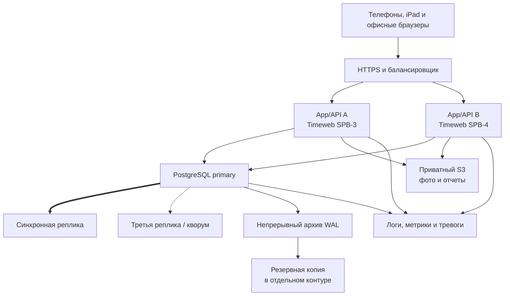

# Модель развертывания в Timeweb Cloud

Статус: утвержденная архитектурная основа B01, без создания инфраструктуры

## 1. Окружения

| Окружение | Назначение | Данные |
|---|---|---|
| Development | локальная разработка и автоматические тесты | только тестовые |
| Staging | приемка релиза, проверка устройств и миграций | обезличенная копия или тестовые |
| Production | работа фабрики | рабочие данные |

Development и staging могут использовать упрощенную конфигурацию. Production не может повторять упрощения, которые снижают сохранность подтвержденных операций.

## 2. Целевая схема production

Компоненты web, API и worker остаются частями одного модульного монолита, но запускаются отдельными процессами. Минимум два экземпляра прикладного слоя позволяют обслуживать пользователей при обновлении или отказе одной машины.

## 3. Правило сохранности

Для команды, меняющей производственные или складские данные:

1. сервер проверяет роль, версию документа и ключ идемпотентности;
2. бизнес-операция, аудит и outbox записываются одной транзакцией;
3. PostgreSQL подтверждает commit только после записи на primary и синхронной реплике;
4. только после этого API показывает пользователю успешное подтверждение;
5. если синхронная копия недоступна и новую безопасную копию выбрать нельзя, критичные записи временно блокируются, а не принимаются с риском потери.

Это обеспечивает целевой RPO 0 для уже подтвержденных операций внутри принятой модели отказов. Резервные копии защищают от логических ошибок, удаления, повреждения и более крупных аварий, но не заменяют синхронную репликацию.

## 4. Timeweb

Timeweb Cloud выбран владельцем проекта.

- production размещается в российских зонах;
- предварительная основная локация — Санкт-Петербург;
- фото и сформированные файлы хранятся в приватном S3 с версионированием и Object Lock;
- соединение с PostgreSQL выполняется по TLS и приватной сети;
- публичный доступ к БД запрещен;
- секреты не хранятся в Git.

Документация Timeweb указывает, что PostgreSQL DBaaS использует асинхронную leader-replica репликацию. Поэтому стандартный DBaaS нельзя считать достаточным доказательством RPO 0. Перед production необходимо:

1. получить у Timeweb документированное предложение с синхронным подтверждением записи; или
2. развернуть собственный PostgreSQL-кластер с синхронной репликацией в нескольких зонах Timeweb.

Полезные официальные материалы:

- [PostgreSQL в Timeweb DBaaS](https://timeweb.cloud/docs/dbaas/postgresql);
- [физические резервные копии DBaaS](https://timeweb.cloud/docs/dbaas/dbaas-manage/backup);
- [зоны доступности Timeweb](https://timeweb.cloud/docs/zony-dostupnosti/servisy-i-zony-dostupnosti);
- [возможности S3](https://timeweb.cloud/docs/s3-storage/supported-features).

## 5. Резервирование

- непрерывный архив WAL;
- ежедневная физическая резервная копия;
- еженедельная контрольная логическая выгрузка;
- S3 с версионированием и Object Lock;
- дополнительная зашифрованная копия вне основного production-контура;
- автоматическая проверка успешности копирования;
- квартальное тестовое восстановление;
- обязательное полное восстановление перед промышленным запуском.

Целевой RPO подтвержденных операций — 0. Проектный RTO — до 4 часов.

## 6. Подтвержденные организационные решения

- бюджет минимум на три узла PostgreSQL и два прикладных узла принят владельцем;
- владельцем аккаунта Timeweb и ответственным за управление доступами является владелец фабрики.

## 7. Что еще нужно решить до production

- кто технически выполняет и проверяет процедуры резервного копирования и восстановления;
- где находится дополнительная резервная копия;
- какой тариф и зоны прошли нагрузочный и аварийный тест.

Никакие ресурсы Timeweb на этапе B01 не создаются и не оплачиваются.
