# Окружения и путь выпуска

Статус: проектное решение B04
Владелец production-аккаунта и доступов: владелец фабрики

## 1. Окружения

| Окружение | Назначение | Данные | Доступ | Допустимые упрощения |
|---|---|---|---|---|
| Local | разработка и быстрые тесты | синтетические | разработчик | один экземпляр приложения и БД |
| Test/CI | автоматические проверки каждого изменения | автоматически созданные тестовые | CI | одноразовая инфраструктура |
| Staging | приемка ролей, устройств, миграций и релиза | тестовые или строго обезличенные | назначенная группа приемки | меньшая мощность, но production-подобные версии и настройки |
| Production | ежедневная работа фабрики | рабочие | только утвержденные сотрудники | нельзя снижать гарантии сохранности |

Production размещается в Timeweb Cloud на двух прикладных и трех
PostgreSQL-узлах согласно [модели развертывания](DEPLOYMENT.md). Платные
ресурсы создаются только перед инфраструктурным прототипом и после проверки
актуальных тарифов.

## 2. Изоляция

- у staging и production разные БД, S3-бакеты, ключи, домены и учетные записи;
- production-БД не доступна из интернета;
- приложение обращается к БД по приватной сети и TLS;
- реальные данные не копируются в local и CI;
- копия production для диагностики сначала обезличивается;
- разработчик не использует общую учетную запись администратора;
- доступ выдается конкретному человеку, на минимальный срок и с минимальными
  правами.

## 3. Конфигурация

Код и образ едины для всех окружений. Различаются только внешние параметры:

- адреса БД и S3; Redis добавляется только при подтверждённой необходимости;
- ключи подписи, push и шифрования;
- публичный домен;
- параметры журналирования и мониторинга;
- разрешенные источники и интеграционные заглушки;
- лимиты ресурсов.

Секреты передаются через защищенные переменные GitHub/Timeweb и не записываются
в образ. Полный порядок находится в [политике секретов](SECRETS.md).

## 4. Путь изменения

```mermaid
flowchart LR
    Task["Задача и критерии"] --> Branch["Ветка"]
    Branch --> PR["Pull request"]
    PR --> CI["CI: проверки и тесты"]
    CI --> Review["Review и приемка решения"]
    Review --> Main["Squash merge в main"]
    Main --> Image["Версионированный образ"]
    Image --> Stage["Staging"]
    Stage --> Gate["Ручное разрешение владельца"]
    Gate --> Prod["Production"]
    Prod --> Verify["Проверка и мониторинг"]
```

Один и тот же образ продвигается со staging на production. Сборка заново между
окружениями запрещена.

## 5. Выпуск

1. CI проверяет код, миграции, тесты и отсутствие секретов.
2. После merge создается неизменяемый образ с commit SHA.
3. Образ разворачивается на staging.
4. Выполняются smoke-тесты и сценарии затронутых ролей.
5. Владелец или назначенный ответственный разрешает production-выпуск.
6. Приложение обновляется по одному узлу без остановки обоих экземпляров.
7. Выполняются smoke-тесты production без изменения хозяйственных данных.
8. Версия, время и исполнитель заносятся в журнал выпусков.

Рекомендуемое окно плановых обновлений до пилота — после завершения дневных
операций и не перед автоматическим формированием плана в 10:00. Точное окно
уточняется по фактическому графику фабрики перед пилотом.

## 6. Откат

- предыдущий образ всегда остается доступен;
- откат приложения выполняется переключением на предыдущий образ;
- совместимые изменения БД проектируются так, чтобы предыдущая версия могла
  временно работать;
- необратимые изменения данных требуют отдельного решения, резервной копии и
  проверенного сценария восстановления;
- откат не должен удалять подтвержденные операции;
- после отката создается запись об инциденте.

## 7. Критерии готовности окружений

До начала пилота должны быть подтверждены:

- автоматическое развертывание одной версии на test и staging;
- раздельные секреты и данные;
- успешная миграция копии предыдущей схемы;
- обновление одного app-узла без потери доступности;
- откат на предыдущий образ;
- потеря одного app-узла без остановки работы;
- отказ primary БД в принятой модели без потери подтвержденной операции;
- полное восстановление в отдельном окружении за время до четырех часов.
