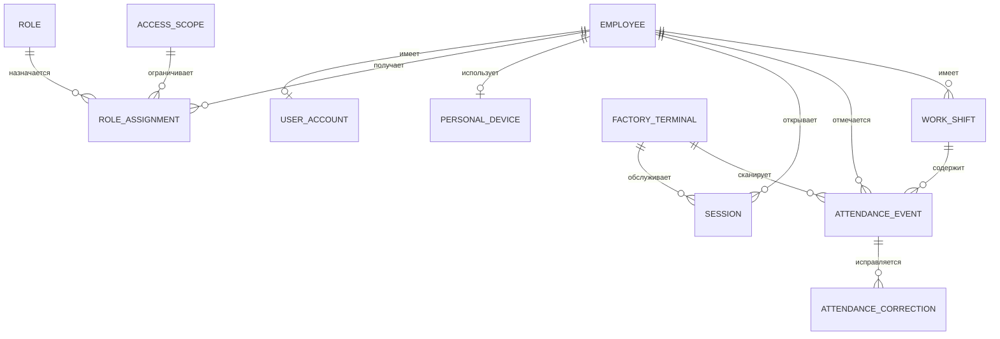
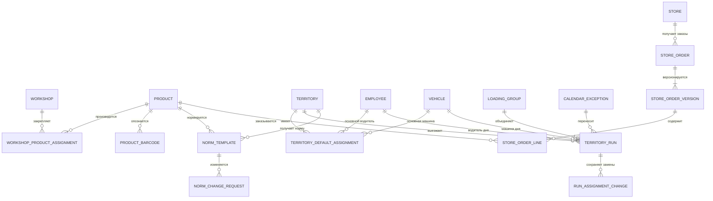
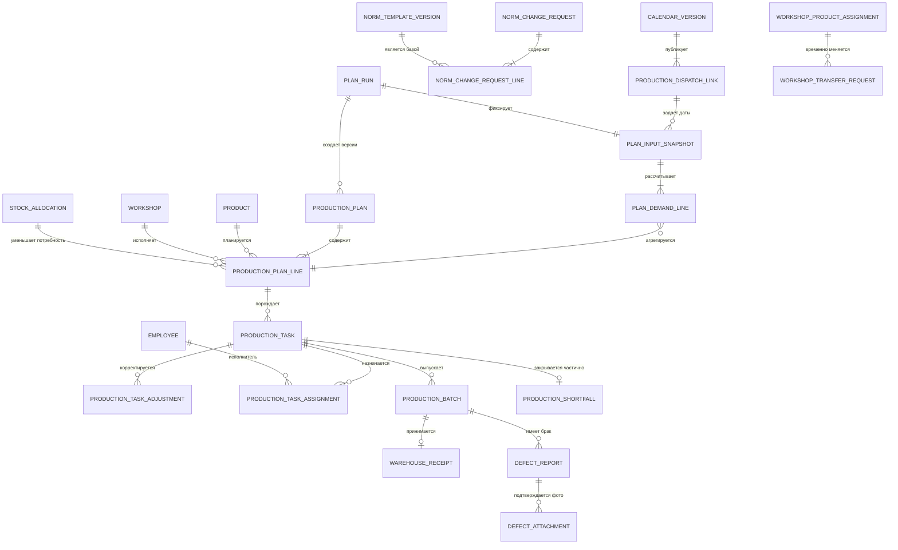
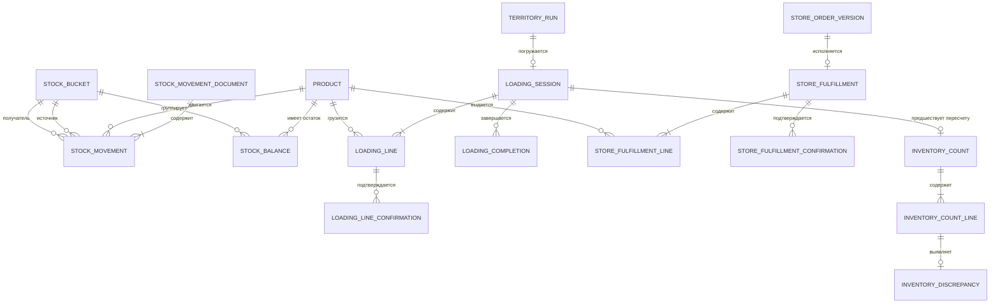
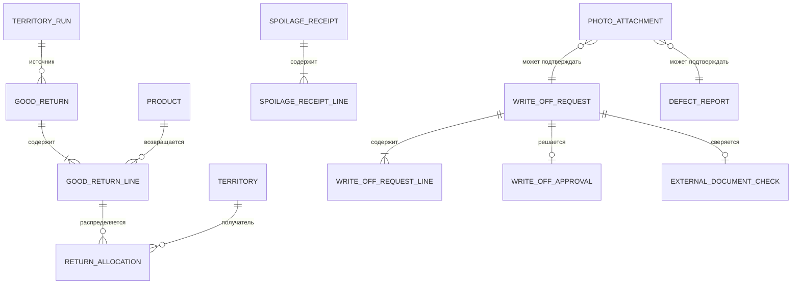

# B02. Логическая ER-модель и словарь данных

Статус: утвержденная основа, физические имена уточняются при подготовке миграций

Связанный документ: `docs/DATA_MODEL.md`

## 1. Правила моделирования

- внутренние идентификаторы не зависят от табельных номеров, штрихкодов и кодов 1С;
- все даты-время событий хранятся с часовым поясом, бизнес-дата — отдельным полем;
- количество тортов в MVP является целым неотрицательным числом;
- деньги, сырье, рецептуры и серийный учет коробок в эту модель не входят;
- справочники архивируются, а не удаляются из истории;
- опубликованные документы версионируются;
- подтвержденные движения товара неизменяемы.

## 2. Сотрудники и табель

| Сущность | Назначение | Ключевые ограничения |
|---|---|---|
| `Employee` | Историческая карточка сотрудника | табельный номер уникален в активном наборе |
| `UserAccount` | Доступ в систему | одна учетная запись на сотрудника |
| `RoleAssignment` | Роль и область действия | периоды назначений не должны конфликтовать |
| `PersonalDevice` | Личный Samsung/iPhone | не более одного активного устройства сотрудника |
| `FactoryTerminal` | Зарегистрированный iPad | уникальный системный идентификатор терминала |
| `Session` | Отзываемая серверная сессия | принадлежит одному аккаунту и устройству |
| `AttendanceEvent` | Неизменяемый приход/уход | одноразовый QR либо ручная причина |
| `WorkShift` | Сводная смена | максимум одна открытая смена сотрудника |
| `AttendanceCorrection` | Исправление табеля | ссылка на исходное событие и обязательная причина |

## 3. Справочники, территории и нормы

| Сущность | Назначение | Ключевые ограничения |
|---|---|---|
| `Product` | Вид товара | активный внутренний код уникален |
| `ProductBarcode` | Штрихкод вида торта | один активный штрихкод относится к одному товару |
| `Workshop` | Настраиваемый цех | архивирование не меняет историю |
| `WorkshopProductAssignment` | Постоянное/временное закрепление | у периода есть начало и окончание |
| `Territory` | Маршрутная единица 1–9 | номер территории уникален |
| `Vehicle` | Машина | регистрационный номер уникален в активном наборе |
| `TerritoryDefaultAssignment` | Основное закрепление | исторические периоды сохраняются |
| `LoadingGroup` | Группа на дату и интервал | один–четыре рейса, порядок явный |
| `TerritoryRun` | Выход на дату | уникальны дата + территория + номер рейса; один водитель и машина |
| `RunAssignmentChange` | История замены | старое и новое назначение, причина, автор и время неизменяемы |
| `CalendarException` | Праздник/перенос | отдельно хранит дату производства и вывоза |
| `NormTemplate` | Недельная норма | территория + день недели + товар + период действия |
| `NormChangeRequest` | Постоянная/разовая корректировка | после утверждения исходный запрос не редактируется |
| `Store` | Фирменный магазин | постоянный внутренний код, область продавца |
| `StoreOrder` | Заказ магазина | один объект на магазин и дату поставки |
| `StoreOrderVersion` | Отправленная версия | после отправки неизменяема; одна заблокированная версия входит в план |

## 4. Планирование и производство

| Сущность | Назначение | Ключевые ограничения |
|---|---|---|
| `CalendarVersion` | Опубликованный календарь | одна версия применяется к дате |
| `ProductionDispatchLink` | Связь вывоза и производства | одна производственная дата на дату вывоза и область |
| `NormTemplateVersion` | Постоянная недельная норма | периоды одного ключа не пересекаются |
| `NormChangeRequestLine` | Предложенное абсолютное значение | хранит base version и решение запроса |
| `PlanRun` | Идемпотентный запуск планирования | один штатный логический запуск на производственную дату |
| `PlanInputSnapshot` | Версии всех входов | неизменяем после публикации |
| `PlanDemandLine` | Расчет направления | формула и все источники количества сохранены |
| `ProductionPlan` | Версия плана | ровно одна актуальная опубликованная версия |
| `ProductionPlanLine` | План по товару и цеху | хранит объяснение расчета |
| `StockAllocation` | Ручное назначение остатка | сумма не превышает доступный остаток |
| `ProductionTask` | Задание цеху | связано с опубликованной строкой плана |
| `WorkshopTransferRequest` | Временная передача товара | после предложения требует решения администратора |
| `ProductionTaskAdjustment` | Изменение цели/цеха | не переписывает задания и партии |
| `ProductionTaskAssignment` | Назначение кондитеру | активная роль, цех и присутствие; один ответственный |
| `ProductionBatch` | Заявленный годный выпуск | целое положительное количество, idempotency key |
| `ProductionShortfall` | Закрытие ниже цели | обязательны причина и комментарий |
| `WarehouseReceipt` | Приемка партии | максимум одна успешная приемка партии |
| `DefectReport` | Производственный брак | отдельное решение ответственного/администратора |
| `DefectAttachment` | Закрытое фото брака | обязательно только по настройке причины |

## 5. Склад и погрузка

| Сущность | Назначение | Ключевые ограничения |
|---|---|---|
| `StockMovementDocument` | Основание атомарной группы движений | тип, автор, бизнес-дата, причина |
| `StockMovement` | Неизменяемая проводка между корзинами | источник не равен получателю; количество положительное |
| `StockBalance` | Быстрое представление | сумма обязана совпадать с журналом |
| `StockReservation` | Резерв плана/погрузки | активный резерв не превышает свободное количество |
| `LoadingSession` | Погрузка конкретного рейса | одна активная сессия на рейс |
| `LoadingLine` | Товар и количество | новая версия после отклонения |
| `LoadingLineConfirmation` | Решение водителя | одно актуальное решение на версию строки |
| `LoadingCompletion` | Финал кладовщика/водителя | завершение только в порядке кладовщик → водитель |
| `StoreFulfillment` | Выдача фирменному магазину | одна активная выдача на store order/current plan |
| `StoreFulfillmentConfirmation` | Финал кладовщика/продавца | склад уменьшается после обоих подтверждений |
| `InventoryCount` | Физический пересчет | один подтвержденный пересчет на контрольный момент |
| `InventoryDiscrepancy` | Факт минус система | не меняет склад без решения |

## 6. Возврат и списание

| Сущность | Назначение | Ключевые ограничения |
|---|---|---|
| `GoodReturn` | Прием годного возврата | водитель-источник обязателен |
| `ReturnAllocation` | Назначение из общего пула | целое количество, не больше доступного пула |
| `SpoilageReceipt` | Физический прием порчи | принимает кладовщик или администратор |
| `WriteOffRequest` | Запрос на списание | причина обязательна |
| `WriteOffApproval` | Решение администратора | одна актуальная версия решения |
| `ExternalDocumentCheck` | Ручная сверка 1С/Agent Plus | номер, результат, автор и время |
| `PhotoAttachment` | Приватное фото | метаданные в БД, объект в S3 |

## 7. Системные сущности

| Сущность | Назначение | Ключевые ограничения |
|---|---|---|
| `AuditEvent` | Неизменяемый аудит | не обновляется и не удаляется обычными ролями |
| `DomainEvent` | Факт бизнес-события | создается в транзакции операции |
| `OutboxMessage` | Надежная фоновая доставка | повторная обработка идемпотентна |
| `Notification` | Внутрисистемная лента | хранит статус прочтения |
| `PushDeliveryAttempt` | История push | ошибка не отменяет операцию |
| `ReportJob` | Формирование Excel/PDF | версия входных данных фиксируется |
| `ImportBatch` | Сеанс массового импорта | staging не меняет рабочие данные до подтверждения |
| `ImportRow` | Исходная строка | хранит номер листа/строки и нормализованное значение |
| `ImportError` | Ошибка проверки | код, поле, понятное сообщение |
| `ExternalCodeMapping` | Будущая интеграция | система-источник + тип + внешний код уникальны |

## 8. Индексы и уникальность

Физическая схема должна предусмотреть:

- уникальность активного табельного номера;
- одно активное личное устройство на сотрудника;
- уникальность активного штрихкода товара;
- защиту от повторного ключа идемпотентности в рамках типа команды;
- уникальность штатного `PlanRun` на производственную дату;
- одну актуальную опубликованную версию плана;
- одну успешную приемку производственной партии;
- отсутствие дублирующего подтверждения версии строки погрузки;
- поиск движений по товару, корзине, бизнес-дате и документу;
- поиск аудита по сотруднику, объекту, действию и correlation ID.

## 9. Порядок подготовки физической схемы

После UX-сценариев B03:

1. уточнить обязательные поля форм;
2. назначить физические имена таблиц и колонок;
3. разделить справочники, документы, строки документов и события;
4. определить ограничения БД и транзакционные границы;
5. подготовить миграцию №1 только для базовых сущностей;
6. проверить миграцию на пустой БД и откат на тестовом окружении;
7. не загружать рабочий Excel напрямую — только через staging.
