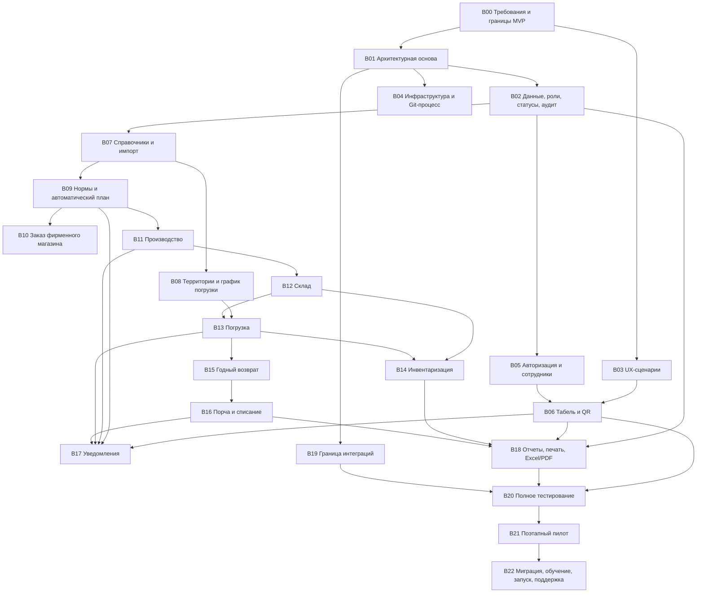

# Дорожная карта системы внутреннего контроля Ташкалинской кондитерской фабрики

Статус: рабочий план проекта, версия 0.2

Основание: `ТЗ_внутренний_контроль_Ташкалинская_версия_0.1.docx` от 30.07.2026 и первичный анализ рабочего Excel `норма_новая_300526-070626.xlsx`

Текущая стадия: B04.1, B05, B06.1–B06.2 и функциональная основа B07 реализованы;
фактическое наполнение товарами, нормами и сотрудниками перенесено в B22;
реализованы B09.1–B09.2, B10.1 и операционные ядра B11.1–B16.1;
следующий блок — B17

Главное правило: переход к коду только после фиксации границ MVP и утверждения архитектурной основы

## 1. Как пользоваться этой дорожной картой

Каждый блок заканчивается проверяемым результатом и решением о переходе дальше. Блок нельзя считать готовым только потому, что написан код: должны быть закрыты зависимости, решения владельца, приемочные сценарии, документация и проверка результата.

Статусы блоков:

- `Не начат` — работы не ведутся.
- `На согласовании` — подготовлены варианты, требуется решение владельца.
- `В работе` — выполняются работы внутри утвержденных границ.
- `На приемке` — результат готов и проверяется по критериям блока.
- `Готово` — выполнено определение «готово», решение зафиксировано.

Оценка трудоемкости дана диапазонами и уточняется после блоков B00–B03:

- малая — несколько рабочих дней;
- средняя — примерно 1–3 человеко-недели;
- крупная — примерно 3–6 человеко-недель;
- очень крупная — более 6 человеко-недель и обычно требует разбиения на несколько итераций.

Это оценка объема работы, а не обещание календарной даты. На срок сильнее всего влияют скорость согласований, качество исходных данных, доступность сотрудников для пилота и количество исправлений по фактическим сценариям фабрики.

## 2. Зафиксированные границы релизов

### MVP

В MVP входит промышленно пригодный контур примерно для 70 сотрудников:

- PWA для телефона, планшета и офиса, работа внутри и вне фабрики;
- роли и области ответственности;
- табель с динамическим одноразовым QR;
- товары, цехи, территории 1–9, сотрудники, водители, машины, календарь и причины;
- массовый импорт товаров и недельных норм;
- недельные нормы, постоянные и разовые корректировки;
- заказ фирменного магазина;
- автоматический план после 10:00;
- производство, брак, передача на склад и остатки;
- погрузка с двойным подтверждением;
- инвентаризация и поиск расхождений;
- годный возврат, общий пул, распределение и списание;
- физическая приемка порчи и ручная сверка с 1С/Agent Plus;
- уведомления, отчеты, печать, Excel/PDF;
- аудит, резервное копирование, мониторинг, обучение и промышленный запуск.

### Следующий релиз

Состав уточняется по итогам пилота. Предварительные кандидаты:

- улучшенная аналитика спроса, возврата и сезонности;
- учет даты производства и партий без уникальной маркировки каждой коробки;
- контроль сроков годности;
- детализация нормы и план/факта по магазинам внутри территории;
- улучшенный ограниченный офлайн-режим;
- автоматизация сверки порчи с импортируемым документом 1С без полной двусторонней интеграции;
- оптимизация экранов и отчетов по фактическим данным пилота.

### Будущее развитие

- полноценный двусторонний обмен с 1С и Agent Plus;
- сырье, рецептуры, полуфабрикаты и нормы расхода;
- авторские и заказные торты;
- прием кассы водителей;
- расчет заработной платы;
- уникальная маркировка коробок и полное партионное прослеживание;
- интеграция с оборудованием и видеонаблюдением.

## 3. Наблюдения по исходному Excel

Исходный файл доступен и был изучен без изменения. Это не готовый формат импорта, а рабочая книга, которую нужно сначала нормализовать.

Выявлено:

- 16 листов, включая текущие нормы, исторические копии, приходную накладную, форму факта производства, сотрудников/закрепления и примечания;
- текущие нормы размещены отдельными листами по дням, без пятницы, блоками по территориям;
- в типовом листе территория занимает около 49 строк, товары разделены на несколько расположенных рядом секций;
- есть формулы итогов и межлистовые ссылки;
- встречаются разные написания дней, территорий и товаров, опечатки, пустые строки и технические секции;
- в книге смешаны нормы, факт, печатные формы, персональные данные, адреса/телефоны, закрепление продукции и сведения о полуфабрикатах;
- исторические листы отличаются по числу территорий и структуре;
- часть технических формул при независимом чтении дает ошибки, поэтому переносить формулы в новую систему нельзя;
- лист с полуфабрикатами относится к будущему контуру и не должен случайно попасть в MVP.

Следствие: импорт MVP должен принимать нормализованный шаблон системы. Для первой миграции нужен отдельный разовый преобразователь старой книги, таблица соответствий и ручное подтверждение неоднозначных строк.

## 4. Последовательность и параллельность

Критический путь: B00 → B01 → B02 → B05/B07 → B09 → B11 → B12 → B13/B14 → B20 → B21 → B22.

Можно вести параллельно после утверждения основы:

- B03 и B04;
- B05 и подготовку B07;
- B06 и B08;
- B10 вместе с частью B11;
- B15 и B18 после стабилизации складского движения;
- B17 как сквозной поток после появления событий;
- B19 параллельно функциональным блокам, пока он не превращается в реализацию интеграции.

Нельзя делать независимо:

- складские остатки без утвержденной модели движений;
- автоматический план без норм, календаря и правил инвентаризации;
- погрузку без назначения водителя, склада и модели двойного подтверждения;
- отчеты как отдельную копию бизнес-логики;
- пилот без наблюдаемости, резервного копирования и сценариев отката.

## 5. Блоки проекта

## B00. Фиксация требований и границ MVP

Статус: `В работе`  
Релиз: основа MVP  
Трудоемкость: средняя

**Цель и границы.** Превратить ТЗ 0.1 в согласованный набор бизнес-правил и приемочных сценариев. Блок не включает проектирование экранов и написание кода.

**Работы.**

- составить реестр требований с идентификаторами;
- разделить обязательное MVP, кандидатов следующего релиза и будущее развитие;
- описать рабочий день фабрики по серверному времени Europe/Moscow;
- зафиксировать определения «норма», «план», «партия», «остаток», «возврат», «порча», «брак»;
- провести короткие интервью с владельцем, производством, складом, логистикой и бухгалтером;
- описать исключения: праздник, отмена/перенос вывоза, ночное производство, отсутствие телефона, сменный водитель, поздняя инвентаризация;
- превратить критерии ТЗ в сценарии «дано — когда — тогда»;
- создать журнал решений и порядок изменения требований.

**Результаты.**

- реестр требований;
- матрица «требование → роль → экран/API → тест»;
- словарь терминов;
- карта процессов «как сейчас / как будет»;
- перечень исключений;
- протокол решений владельца;
- утвержденная граница MVP.

**Входные зависимости.** ТЗ 0.1, исходный Excel, доступ к владельцу и ответственным сотрудникам.

**Нужно согласовать.**

- точные смены и правила опоздания/незакрытой смены;
- кто и до какого момента может исправлять табель;
- кто подтверждает выдачу заказа фирменному магазину;
- окончательные причины невыполнения, брака, ручной отметки и списания;
- обязательность фотографий;
- формат и обязательность номера документа 1С/Agent Plus;
- срок хранения данных и аудита;
- что означает четверг без производства при наличии пятничного маршрута территории 9 в Excel;
- какие данные старой книги являются действующими, а какие архивными.

**Приемка и «готово».**

- у каждого требования есть владелец, приоритет и проверяемый критерий;
- противоречия ТЗ и Excel зафиксированы и имеют решение;
- все вопросы, влияющие на модель данных и безопасность, закрыты;
- владелец письменно подтверждает границы MVP.

**Параллельность.** Можно параллельно начать исследование UX и профилирование данных. Архитектуру можно анализировать, но нельзя окончательно утверждать до закрытия ключевых правил.

**Риски.**

- неформальные правила обнаружатся только на пилоте;
- разные подразделения по-разному понимают одну операцию;
- попытка добавить в MVP сырье, полуфабрикаты или расчет зарплаты.

## B01. Архитектура системы и выбор технологий

Статус: `На приемке` — архитектурная основа утверждена 30.07.2026, проверки Timeweb и целевых устройств не завершены

Релиз: основа MVP

Трудоемкость: средняя

**Цель и границы.** Утвердить техническую основу, которая выдержит промышленную эксплуатацию и последующее развитие. Блок завершается решениями и прототипами рисков, но не полноценным приложением.

**Работы.**

- выбрать модульный монолит или другой вариант развертывания;
- определить границы модулей и правила их взаимодействия;
- выбрать клиентскую, серверную и серверную инфраструктуру;
- определить API, фоновые задания, очереди, хранение файлов и push;
- спроектировать модель надежности, идемпотентность и конкуренцию подтверждений;
- выбрать подход к ограниченному офлайн-режиму;
- провести малые технические проверки рисков: камера/штрихкод, QR 5 секунд, Web Push на целевых устройствах, печать;
- сформировать ADR — записи архитектурных решений;
- провести моделирование угроз.

**Результаты.**

- `docs/ARCHITECTURE_DECISIONS.md`;
- `docs/DEPLOYMENT.md`;
- ADR в `docs/adr/`;
- контекстная и контейнерная схемы;
- список модулей;
- черновик API-конвенций;
- модель развертывания;
- модель угроз;
- перечень технических прототипов и их выводов.

**Входные зависимости.** B00 в части критичных правил; перечень целевых устройств; ограничения по размещению данных.

**Нужно согласовать.**

- размещение: облако/ЦОД/локальный сервер и требования к хранению данных;
- допустимая зависимость от интернета;
- единый TypeScript-стек или отдельный backend;
- управляемая или самостоятельная PostgreSQL;
- целевые браузеры и модели планшетов;
- допустимость использования внешнего push-сервиса;
- целевые RPO/RTO и бюджет инфраструктуры.

**Приемка и «готово».**

- все решения, блокирующие модель данных и инфраструктуру, имеют статус «принято»;
- подтверждена работа ключевых браузерных возможностей на пилотных устройствах;
- архитектура обеспечивает аудит, восстановление, идемпотентные операции и будущие интеграционные адаптеры;
- код приложения не начат до утверждения основы.

**Параллельность.** Совместно с B03; после выбора базового стека запускается B04. B02 начинается после фиксации модульных границ.

**Риски.**

- недоступность Web Push/камеры на конкретных устройствах;
- чрезмерно сложная распределенная архитектура;
- локальный сервер без компетенций поддержки;
- неверная оценка качества связи на фабрике.

## B02. Модель данных, роли, права, статусы и журнал действий

Статус: `Готово` — D-01…D-08 утверждены владельцем, D-09…D-10 приняты как проектные правила, сценарная проверка пройдена 30.07.2026

Релиз: MVP  
Трудоемкость: крупная

**Цель и границы.** Создать единую доменную модель и правила изменения состояния. Не проектировать поля только под внешний вид текущего Excel.

**Работы.**

- построить концептуальную и логическую модели данных;
- определить агрегаты документов и неизменяемые идентификаторы;
- спроектировать журнал движений товара и вычисляемые остатки;
- определить статусы, допустимые переходы и полномочия переходов;
- создать RBAC с областью ответственности по цеху, территории и подразделению;
- разрешить несколько ролей одной учетной записи;
- спроектировать аудит старого/нового значения, причины, автора и связанного документа;
- определить правила административной корректировки через компенсирующие операции;
- описать конкурентное обновление и версионирование документов;
- классифицировать персональные и производственные данные.

**Результаты.**

- утвержденная модель `docs/DATA_MODEL.md`;
- логическая ER-модель и словарь `docs/ER_MODEL.md`;
- инварианты, движения и аудит `docs/DOMAIN_INVARIANTS.md`;
- протокол приемки `docs/B02_ACCEPTANCE.md`;
- ER-диаграмма и словарь данных;
- матрица ролей и прав;
- диаграммы состояний;
- каталог событий аудита;
- правила движений и контрольных балансов;
- политика хранения и удаления;
- набор инвариантов базы данных.

**Входные зависимости.** B00, B01.

**Нужно согласовать.**

- бухгалтер создает корректировку, прошлый период подтверждает администратор — принято;
- кладовщик распределяет возврат до публикации плана, после нее требуется администратор — принято;
- временный перенос товара предлагает ответственный цеха, подтверждает администратор — принято;
- отрицательные остатки запрещены — принято;
- второй администратор в MVP не требуется, руководитель получает уведомление — принято;
- оперативное хранение один год с архивом обязательных документов — принято.

**Приемка и «готово».**

- каждый статус имеет допустимые входы/выходы;
- для каждой критичной операции определены автор, время, причина и аудит;
- запреты проверяются сервером, а не только интерфейсом;
- балансы склада и возврата воспроизводятся из движений;
- модель покрыта примерами из приемочных сценариев.

**Параллельность.** Матрица ролей и статусы могут прорабатываться параллельно. Финальная схема предшествует основным функциональным модулям.

**Риски.**

- хранение только текущего остатка без истории;
- удаление ошибочных операций вместо корректировки;
- чрезмерно широкие права администратора без контроля;
- смешение годного возврата и свободного склада.

## B03. UX-сценарии и адаптивные интерфейсы

Статус: `На приемке` — U-01…U-08 утверждены, кликабельный прототип подготовлен и технически проверен 31.07.2026

Релиз: MVP  
Трудоемкость: крупная

**Цель и границы.** Спроектировать быстрые ролевые сценарии для телефона, производственного планшета и офиса. Визуальная красота не должна увеличивать число действий на частых операциях.

**Работы.**

- провести наблюдение за сменой, приемкой и погрузкой;
- составить карты задач по ролям;
- определить информационную архитектуру и ролевые главные экраны;
- сделать низкодетальные прототипы;
- проверить телефонные сценарии водителя/сотрудника;
- проверить планшетные сценарии цеха/склада;
- проверить офисные сценарии администратора/руководителя/бухгалтера;
- спроектировать ошибки связи, двойной ввод, конфликт и возврат на исправление;
- определить требования доступности, крупные зоны касания и работу в перчатках;
- провести коридорные тесты с реальными сотрудниками.

**Результаты.**

- карта экранов и сценарии `docs/UX_SCENARIOS.md`;
- кликабельный прототип `prototypes/ux/`;
- техническая проверка `docs/B03_PROTOTYPE_REVIEW.md`;
- кликабельные прототипы;
- библиотека компонентов и состояний;
- правила адаптивности;
- тексты ошибок, подтверждений и уведомлений;
- протокол UX-проверок.

**Входные зависимости.** B00; черновые роли B02.

**Нужно согласовать.**

- язык терминов на производстве;
- минимально приемлемый размер элементов;
- ориентация планшетов;
- нужен ли отдельный киоск-режим терминала;
- состав «Центра контроля на сегодня»;
- формат бумажных форм.

**Приемка и «готово».**

- ключевые операции выполняются без скрытых инструкций;
- сотрудник, водитель и кладовщик проходят сценарий на целевом устройстве;
- есть состояния загрузки, отсутствия сети, конфликта и запрета;
- прототипы подписаны владельцами процессов.

**Параллельность.** Идет вместе с B01 и уточняет B02. Высокодетальный дизайн делается после стабилизации сценариев.

**Риски.**

- проектирование по офисному представлению без наблюдения за цехом;
- слишком плотные таблицы на телефоне;
- подтверждения, которые замедляют погрузку.

## B03.2. Дизайн-система и финальный интерактивный прототип

Статус: `Не начат; базовые визуальные токены появились в B04.1`
Релиз: обязательная основа MVP
Трудоемкость: крупная

**Цель и границы.** Утвердить полноценный внешний вид и поведение ролевых
интерфейсов до их массовой реализации. Низкодетальный прототип B03 и стартовый
экран B04.1 не являются финальным дизайном.

**Работы.**

- выбрать визуальное направление и связь с фирменным стилем фабрики;
- создать цвета, типографику, сетку, отступы и иконки;
- создать доступные кнопки, формы, таблицы, карточки, статусы и уведомления;
- определить состояния loading, offline, ошибка, конфликт и подтверждение;
- сделать адаптивные макеты для телефона, iPad и офиса;
- подготовить высокодетальные экраны ключевых ролей;
- собрать интерактивный прототип сквозных сценариев;
- проверить его с владельцем и представителями фабричных ролей;
- передать спецификации компонентов в код.

**Результаты.**

- дизайн-система и библиотека компонентов;
- адаптивные макеты;
- интерактивный прототип;
- таблица состояний каждого компонента;
- протокол проверки на целевых устройствах;
- решение владельца о переходе к массовой реализации UI.

**Входные зависимости.** B03, B04.1 и стабилизированные сценарии B05–B17.
Базовые компоненты можно проектировать раньше, финальные экраны — после
согласования соответствующего процесса.

**Нужно согласовать.**

- фирменные цвета, логотип и допустимое использование бренда;
- плотность рабочих экранов;
- приоритет светлой/тёмной темы;
- сотрудники для короткой проверки прототипа;
- список экранов, которые владелец утверждает лично.

**Приемка и «готово».**

- все ключевые роли проходят сквозные сценарии в прототипе;
- элементы доступны пальцем и читаемы на целевых устройствах;
- опасные и необратимые действия визуально различаются;
- статус сети и серверного подтверждения нельзя пропустить;
- компоненты имеют спецификацию для frontend;
- владелец подписал финальное визуальное направление.

**Параллельность.** Дизайн-система идёт параллельно B05–B12; высокодетальные
макеты соответствующего модуля должны быть приняты до его финальной
frontend-реализации.

**Риски.**

- красивый интерфейс, который замедляет фабричную операцию;
- разные компоненты для одинакового действия;
- проверка только на офисном мониторе;
- финальный дизайн после уже написанного frontend.

## B04. Инфраструктура разработки, Git-процесс, окружения, резервирование и мониторинг

Статус: `В работе — GitHub baseline и CI активированы; staging и аварийные тесты ожидают настройки`
Релиз: основа MVP  
Трудоемкость: средняя

**Цель и границы.** Создать воспроизводимый и безопасный путь от изменения к тестовому и промышленному окружению.

**Работы.**

- определить структуру репозитория и правила веток;
- настроить форматирование, линтеры, проверки типов и тесты;
- настроить CI с проверкой миграций и сборки;
- создать окружения local, test, stage, production;
- определить управление секретами и доступом;
- описать схему версий и миграций БД;
- настроить структурные логи, метрики, трассировки и оповещения;
- настроить резервные копии и отдельное хранение копий;
- провести пробное восстановление;
- подготовить runbook выпуска, отката и инцидента.

**Результаты.**

- правила CONTRIBUTING и Git;
- CI/CD;
- шаблоны окружений;
- политика секретов;
- панели мониторинга и алерты;
- журнал резервных копий;
- протокол восстановления;
- эксплуатационные инструкции.

**Подготовленные материалы.**

- [правила Git и pull request](../CONTRIBUTING.md);
- [окружения и путь выпуска](ENVIRONMENTS.md);
- [политика секретов](SECRETS.md);
- [эксплуатация, мониторинг и восстановление](OPERATIONS.md);
- [план сведения локальной и GitHub-истории](REPOSITORY_BASELINE.md);
- [чек-лист приемки B04](B04_ACCEPTANCE.md);
- `.github/workflows/repository-checks.yml` и локальная команда
  `bash scripts/check-repository.sh`.

**Входные зависимости.** B01 и решение по размещению.

**Нужно согласовать.**

- кто имеет доступ к production;
- окно обновлений;
- допустимый простой;
- срок хранения резервных копий;
- каналы срочных оповещений;
- ответственный за инфраструктуру после запуска.

**Приемка и «готово».**

- одинаковая версия разворачивается на test и stage;
- production не собирается вручную на сервере;
- секреты не хранятся в Git;
- восстановление проверено на отдельном окружении;
- есть алерт на недоступность, ошибку фонового плана, очередь и резервную копию.

**Параллельность.** После B01 идет параллельно B02–B03 и опережает разработку функций.

**Риски.**

- единственный сервер без проверенного восстановления;
- ручные изменения production;
- логи с персональными данными или токенами;
- отсутствие владельца инцидента.

## B04.1. Технический каркас приложения

Статус: `В реализации — код, локальные проверки и контейнерная конфигурация подготовлены; ожидается CI`
Релиз: основа MVP
Трудоемкость: средняя

**Цель и границы.** Создать первый реальный программный срез на утверждённом
стеке. Бизнес-функции в этот блок не входят.

**Работы.**

- создать npm workspaces;
- создать Next.js PWA;
- создать NestJS API и OpenAPI;
- создать отдельный worker;
- создать общие contracts/database-пакеты;
- добавить PostgreSQL 18 и идемпотентные миграции;
- добавить health/readiness, correlation ID и структурные логи;
- подготовить Docker Compose и отдельные образы;
- включить lint, типы, тесты, audit и production-сборку в CI;
- создать первый адаптивный рабочий экран.

**Результаты.**

- [описание технического каркаса](B04_1_APPLICATION_FOUNDATION.md);
- `apps/web`, `apps/api`, `apps/worker`;
- `packages/contracts`, `packages/database`;
- `compose.yaml` и `deploy/docker`;
- `package-lock.json`;
- миграция системного outbox и аудита;
- расширенный GitHub Actions.

**Входные зависимости.** Утверждённые B01, критичные решения B02, UX B03 и
инфраструктурные правила B04.

**Приемка и «готово».**

- чистый `npm ci` воспроизводим;
- web/API/worker собираются;
- стартовый экран и API liveness работают;
- PostgreSQL-миграция идемпотентна;
- audit не содержит high/critical;
- CI собирает все три контейнера;
- код объединён в `main`.

**Параллельность.** После каркаса начинается код B05. Проектирование B13–B17 и
финальный UI-дизайн могут идти впереди реализации функциональных модулей.

**Риски.**

- раннее смешение доменных модулей;
- фиктивная offline-работа критичных операций;
- разные версии процессов;
- непроверяемые миграции;
- зависимость local-разработки только от Docker.

## B05. Авторизация и управление сотрудниками

Статус: `Программный контур B05 реализован; полевая приемка на целевых устройствах остается воротами перед пилотом`
Релиз: MVP  
Трудоемкость: средняя

**Цель и границы.** Дать сотрудникам безопасный вход и строго ограниченный доступ. Самостоятельной публичной регистрации нет.

**Работы.**

- создание/архивация сотрудника администратором;
- первый вход, установка/смена пароля и системный PIN/биометрия через WebAuthn;
- восстановление доступа по управляемой процедуре;
- сессии, выход со всех устройств и блокировка;
- назначение нескольких ролей и областей ответственности;
- регистрация планшета как терминала подразделения;
- привязка и отзыв пользовательского устройства;
- аудит входов, ролей, устройств и блокировок;
- защита от перебора и похищения сессии.

**Результаты.**

- модуль идентификации;
- экраны сотрудников, ролей, устройств и сессий;
- политика паролей/PIN;
- инструкции администратора;
- тесты прав доступа.

**Подготовленные материалы.**

- [проект авторизации и управления сотрудниками](B05_AUTHORIZATION_DESIGN.md);
- [приемочные сценарии A05-01–A05-15](B05_ACCEPTANCE_SCENARIOS.md).
- [реализация ядра B05.1](B05_1_IDENTITY_CORE.md).
- [защищенные устройства и терминалы B05.2](B05_2_DEVICE_SECURITY.md).
- [закрытие административного контура B05](B05_ACCESS_ADMIN_COMPLETION.md).

**Входные зависимости.** B02, B04, B03.

**Нужно согласовать.**

- пароль, PIN или комбинация по ролям;
- кто выдает и сбрасывает доступ;
- срок неактивности сессии;
- обязательность привязки телефона;
- допустимость входа одного сотрудника с нескольких телефонов;
- процедура увольнения/временной блокировки.

**Приемка и «готово».**

- права проверяются на сервере;
- заблокированный сотрудник теряет активные сессии;
- терминал работает только в назначенном подразделении;
- изменение роли полностью журналируется;
- ролевые негативные тесты проходят.

**Параллельность.** Основа предшествует всем ролевым функциям; экран сотрудников можно развивать вместе с B07.

**Риски.**

- общий аккаунт цеха;
- PIN без защиты от перебора;
- сохранение прав после смены роли.

## B06. Электронный табель с динамическим QR

Статус: `B06.1–B06.2 реализованы: QR, контроль, ручные отметки, корректировки и MISSING_EXIT; B06.3 — устройства и пилот`
Релиз: MVP, пилот 1  
Трудоемкость: крупная

**Цель и границы.** Фиксировать приход/уход серверным временем через личный динамический QR и зарегистрированный терминал. Расчет зарплаты не входит.

**Работы.**

- создать смены, графики и правила открытой смены;
- выдавать короткоживущий одноразовый QR-токен;
- сканировать его камерой зарегистрированного планшета;
- проверять сотрудника, срок, терминал и повторное использование;
- фиксировать приход/уход, подразделение, смену и устройство;
- показывать отсутствующих, опоздавших, замены и незакрытые смены;
- реализовать ручную отметку с обязательной причиной;
- дать сотруднику собственный табель, бухгалтеру — период и корректировки;
- добавить журнал исключений и выгрузки;
- провести проверку скорости и устойчивости при начале смены.

**Результаты.**

- телефонный экран QR;
- терминальный сканер;
- панель ответственного;
- табель и журнал ручных действий;
- набор анти-replay тестов;
- инструкция при отсутствии телефона/связи.

**Подготовленные материалы.**

- [протокол динамического QR, смен и ручных исключений](B06_ATTENDANCE_DESIGN.md);
- [приемочные сценарии A06-01–A06-22](B06_ACCEPTANCE_SCENARIOS.md);
- [результат первого рабочего среза B06.1](B06_1_DYNAMIC_QR_CORE.md);
- [контроль табеля, ручные отметки и корректировки B06.2](B06_2_ATTENDANCE_CONTROL.md).

**Входные зависимости.** B03, B05, справочник смен B07, B04.

**Нужно согласовать.**

- точные границы смен;
- допуск по времени и определение опоздания;
- кто закрывает незавершенную смену;
- нужна ли геопроверка или достаточно зарегистрированного терминала;
- поведение при нестабильной сети;
- срок хранения QR-событий.

**Приемка и «готово».**

- QR меняется примерно каждые 5 секунд и повторно не принимается;
- время клиента не влияет на отметку;
- незарегистрированный терминал получает отказ;
- ручная отметка невозможна без причины и видна бухгалтеру;
- табель корректно выгружается за период;
- пилот одного подразделения проходит без критических ошибок.

**Параллельность.** Можно реализовывать одновременно с B08 после готовности B05. Полностью автономен от товарного контура, но использует общие аудит и уведомления.

**Риски.**

- плохая камера или освещение;
- задержка сети больше срока токена;
- передача скриншота QR;
- массовая очередь у одного планшета.

## B07. Справочники и массовый импорт товаров/норм из Excel

Статус: `Функциональная основа реализована; профиль источника перепроверен; наполнение рабочими данными перенесено в B22`
Релиз: MVP  
Трудоемкость: крупная

**Цель и границы.** Создать надежные справочники и безопасный импорт. В MVP не импортируются полуфабрикаты, магазины территории и персональные данные из несогласованных областей старой книги.

**Работы.**

- справочники товаров, категорий, цехов, сотрудников, причин, смен и календаря;
- уникальные внутренние коды и штрихкоды;
- архивирование без удаления истории;
- скачать нормализованный шаблон Excel;
- загрузить файл в промежуточную область;
- проверить типы, ссылки, дубликаты, неоднозначности и даты;
- показать предпросмотр без изменения данных;
- выгрузить строки с ошибками и пояснениями;
- подтвердить импорт администратором;
- обеспечить идемпотентность повторной загрузки;
- создать разовый преобразователь исходной рабочей книги;
- подготовить таблицу соответствий старых названий товара новым кодам;
- журналировать файл, автора, контрольную сумму и результат.

**Результаты.**

- справочники;
- шаблоны импорта товаров и норм;
- валидатор и отчет ошибок;
- staging-модель импорта;
- разовый миграционный преобразователь;
- протокол качества исходных данных.

**Подготовленные материалы.**

- [профиль и качество исходной рабочей книги](B07_SOURCE_WORKBOOK_PROFILE.md);
- [проект справочников, staging и массового импорта](B07_IMPORT_DESIGN.md);
- [приемочные сценарии A07-01–A07-22](B07_ACCEPTANCE_SCENARIOS.md);
- [результат рабочего среза B07.1](B07_1_CATALOG_IMPORT_CORE.md);
- [подготовка первой миграции и решения владельца B07.2](B07_2_MIGRATION_PREPARATION.md);
- [пустой нормализованный шаблон v1.0](../templates/import/README.md).

**Входные зависимости.** B02, B04, B05; исходный Excel.

**Нужно согласовать.**

- источник истинного кода товара;
- перечень действующих товаров и штрихкодов;
- обработка одного товара с разными написаниями/весом;
- что считать территорией 9 в разные дни;
- дата начала действия первой импортированной нормы;
- можно ли импортировать нулевые позиции или их не хранить;
- кто утверждает таблицу соответствий.

**Приемка и «готово».**

- ошибочный файл не меняет рабочие данные;
- повтор того же файла не создает дубликаты;
- каждая строка имеет понятный результат;
- контрольные суммы по территориям сверены с исходной книгой;
- персональные и будущие данные не попадают в MVP без решения;
- импорт можно откатить как одну управляемую операцию.

**Параллельность.** Справочники и анализ преобразователя можно вести параллельно. Финальная миграция следует после утверждения модели товара и норм.

**Решение по последовательности.** Владелец решил не заполнять реальные товары,
нормы и сотрудников во время разработки. Следующие блоки реализуются на
обезличенных тестовых данных; очистка, ручной ввод или импорт рабочих данных,
контрольные суммы и утверждение выполняются в B22 перед пилотом/запуском.

**Риски.**

- неоднозначные названия и опечатки;
- дубли штрихкодов;
- скрытая бизнес-логика в формулах Excel;
- случайный импорт персональных данных и полуфабрикатов.

## B08. Территории, водители, машины и график погрузки

Статус: `B08.2 реализован: справочники, график, ролевые экраны и проверка табеля перед погрузкой`
Релиз: MVP  
Трудоемкость: средняя

**Цель и границы.** Зафиксировать территорию как основную маршрутную единицу и назначение водителя на дату. Маршрутизация по магазинам не входит.

**Работы.**

- справочник территорий 1–9;
- основная машина и основной водитель;
- сменный водитель на дату;
- проверка уникального назначения территории;
- фиксация выхода водителя в табеле/операционном контуре;
- справочник машин и статусов активности;
- группы погрузки по 3–4 водителя;
- временные интервалы и исключения;
- представление текущего состава групп.

**Результаты.**

- карточки территории и машины;
- экран назначения водителя;
- календарь групп погрузки;
- серверные проверки конфликтов;
- журнал изменений.

**Подготовленные материалы.**

- [проект территорий, рейсов и групп погрузки](B08_LOGISTICS_DESIGN.md);
- [приемочные сценарии A08-01–A08-22](B08_ACCEPTANCE_SCENARIOS.md);
- [рабочий срез ядра логистики B08.1](B08_1_LOGISTICS_CORE.md);
- [ролевые сценарии логистики B08.2](B08_2_LOGISTICS_ROLES.md);
- [ADR-0006 о рейсах и переназначении](adr/0006-logistics-runs-and-reassignment.md).

**Входные зависимости.** B05, B06 в части выхода, B07.

**Согласованные решения и начальные данные.**

- коды территорий 1–9 постоянны, названия настраиваются как начальные данные;
- территория 9 единая, дополнительные выезды оформляются отдельными рейсами;
- один водитель может обслуживать несколько территорий только последовательно;
- машина меняется независимо от водителя;
- группа содержит до четырех рейсов, точные интервалы заполняются перед staging;
- после начала погрузки прямое переназначение запрещено, применяется аварийный
  регламент администратора.

**Рабочая реализация.** Срез B08.2 включает модель PostgreSQL, защищенный API,
конфликты водителя/машины/зоны, неизменяемую историю, административный экран,
представления водителя и склада, а также проверку открытой смены перед допуском.
Реальные логистические данные остаются в B22.

**Приемка и «готово».**

- на один рейс территории нельзя назначить двух активных водителей;
- интервалы одного водителя или машины не пересекаются;
- смена водителя не меняет постоянного водителя;
- документ погрузки получает водителя и машину на дату;
- группы фильтруют рабочий экран кладовщика.

**Параллельность.** Вместе с B06 и подготовкой B09. Нужен до B13.

**Риски.**

- неоднозначная территория 9;
- изменения назначения во время операции;
- отсутствие правил замены машины.

## B09. Недельные нормы, корректировки, календарь и автоматический план после 10:00

Статус: `B09.1–B09.2 и реальные входы B10/B12/B14 реализованы; пул возврата подключается в B15`
Релиз: MVP  
Трудоемкость: очень крупная

**Цель и границы.** Хранить версионируемые нормы и автоматически публиковать воспроизводимый план следующего рабочего дня. Прогнозирование спроса не входит.

**Работы.**

- разделить реализацию на две внутренние фазы:
  - фаза A — нормы, корректировки, календарь, версия входов и расчетный контракт; она открывает разработку производства;
  - фаза B — финальная публикация с реальным заказом магазина, складским остатком и статусом инвентаризации; только после нее блок считается готовым;
- недельный шаблон «территория × день недели × товар»;
- версии постоянных норм с датой начала действия;
- разовые корректировки на дату;
- запрос основного водителя и решение администратора;
- запрет постоянной корректировки сменному водителю;
- блокировка завтрашней нормы после 10:00;
- производственный/вывозной календарь с четвергом, пятницей и исключениями;
- расчет следующего рабочего дня;
- снапшот входных данных плана;
- формула: нормы + разовые корректировки + заказ магазина − свободный годный остаток;
- отдельное распределение возврата, не уменьшающее постоянную норму;
- автоматическая публикация после 10:00 с блокировкой повторного запуска;
- предупреждение при отсутствии подтвержденной инвентаризации;
- версия и административное изменение опубликованного плана;
- уведомления затронутым цехам и сотрудникам;
- возможность объяснить каждую цифру плана.

**Результаты.**

- экраны недели, запроса и решения;
- календарь;
- расчетный сервис;
- план с версиями и источниками;
- фоновые задания и журнал запуска;
- сценарии повторного запуска/восстановления;
- набор эталонных расчетов.

**Подготовленные материалы.**

- [проект норм, календаря и автоматического плана](B09_PLANNING_DESIGN.md);
- [эталонные расчеты RC-01–RC-16](B09_REFERENCE_CALCULATIONS.md);
- [приемочные сценарии A09-01–A09-32](B09_ACCEPTANCE_SCENARIOS.md);
- [рабочая реализация норм и календаря B09.1](B09_1_NORMS_CALENDAR.md);
- [рабочая реализация расчетного плана B09.2](B09_2_PRODUCTION_PLAN.md);
- [ADR-0007 об отсечке и snapshot](adr/0007-planning-cutoff-and-snapshots.md).

**Входные зависимости.** Для фазы A — B02, B07 и B08. Для фазы B — B10, B12 и B14. Это управляемая поэтапная интеграция, а не разрешение считать план готовым на временных данных.

**Согласованные решения и начальные данные.**

- момент 10:00 входит в закрытый период, используется серверное время Москвы;
- scheduler ежедневно выбирает следующую открытую производственную дату;
- разовая абсолютная корректировка заменяет постоянную на одну дату;
- отрицательное производство округляется до нуля с объяснением избытка;
- свободный остаток распределяет только кладовщик или администратор;
- опубликованный план меняет только администратор новой версией;
- ночные изделия остаются в одной бизнес-дате с отдельным окном;
- четверг/пятница и территория 9 задаются календарем и областными исключениями;
- точные рабочие связи дней, ночные товары и SLA заполняются перед staging.

**Приемка и «готово».**

- постоянная корректировка влияет только на будущие соответствующие дни;
- разовая — только на указанную дату;
- прошедшие планы не пересчитываются;
- после 10:00 водитель не меняет следующую норму;
- один и тот же запуск не создает второй план;
- план воспроизводится из сохраненного снапшота;
- отсутствие инвентаризации не блокирует план, но создает тревогу;
- любое изменение опубликованного плана журналируется и рассылается.

**Параллельность.** UI нормы можно вести с B10. Финальный расчет требует складского остатка, поэтому интеграция с B12–B14 последовательна.

**Риски.**

- скрытая логика распределения остатков;
- гонка между поздней инвентаризацией и публикацией;
- повторный план после сбоя;
- неверный производственный день из-за календаря.

## B10. Фирменный магазин и заказ

Статус: `Часть A B10.1 реализована; часть B физической выдачи ожидает B12`
Релиз: MVP  
Трудоемкость: средняя

**Цель и границы.** Добавить заказ магазина сегодня на завтра в производственную потребность. Продажи и касса магазина не входят.

**Работы.**

- роль продавца и область доступа;
- черновик и отправка заказа на следующую рабочую дату;
- позиции товара и количества;
- блокировка обычного изменения после 10:00;
- административное позднее изменение;
- включение заказа в план и объяснение источника;
- статус выдачи магазина согласно согласованной роли;
- история и отчет.

**Результаты.**

- экран заказа;
- серверные правила срока;
- связь с версией плана;
- уведомления о поздней правке;
- печатная/отчетная форма.

**Подготовленные материалы.**

- [проект заказа и выдачи фирменному магазину](B10_FACTORY_STORE_DESIGN.md);
- [приемочные сценарии A10-01–A10-26](B10_ACCEPTANCE_SCENARIOS.md);
- [рабочая реализация части A B10.1](B10_1_STORE_ORDER.md);
- [ADR-0008 о версиях заказа и двойной выдаче](adr/0008-store-order-and-handover.md).

**Входные зависимости.** Для части A — B05, B07, B09. Для части B — B12.

**Согласованные решения и начальные данные.**

- кладовщик готовит выдачу, продавец подтверждает получение;
- магазин не получает автоматический приоритет свободного остатка;
- продавец заказывает только на ближайшую открытую дату поставки;
- поздняя правка проходит через запрос и решение администратора;
- магазин является отдельным направлением плана и выдачи, не территорией;
- точное отображаемое название, лимиты строк и время напоминаний заполняются
  перед staging.

**Приемка и «готово».**

- заказ до 10:00 автоматически входит в план;
- позднее изменение требует администратора;
- вклад магазина виден отдельно;
- выдача не уменьшает склад дважды.

**Параллельность.** Вместе с UI и расчетной частью B09; до приемки B11.

**Риски.**

- неопределенная выдача;
- двойной учет заказа и складского остатка;
- смешение с розничными продажами.

## B11. Производство по цехам, задания, факт, причины и брак

Статус: `B11.1 реализован: задания, назначения, партии, сверхплан, невыполнение и брак; полная приемка — B12/B20`
Релиз: MVP, пилоты 1–2  
Трудоемкость: очень крупная

**Цель и границы.** Превратить опубликованный план в задания цехам и подтвержденный факт выпуска. Сырье и полуфабрикаты не входят.

**Работы.**

- группировка плана по основному цеху товара;
- временная передача позиции другому цеху;
- распределение заданий присутствующим сотрудникам;
- командное задание с одним ответственным;
- дневная/ночная смена и настройка товара;
- поэтапный выпуск партиями;
- очередь «произведено — ожидает приемки»;
- факт, частичное выполнение и обязательная причина;
- блокировка исправления после приемки;
- административная корректировка с причиной;
- производственный брак: товар, количество, причина, сотрудник, фото;
- подтверждение брака ответственным/администратором;
- отдельный сценарий ночных «Наполеонов».

**Результаты.**

- панели цеха и сотрудника;
- задания и партии;
- очередь на склад;
- реестр причин и брака;
- фото-вложения;
- отчеты план/факт;
- тесты переходов состояния.

**Подготовленные материалы.**

- [проект производства, партий и брака](B11_PRODUCTION_DESIGN.md);
- [приемочные сценарии A11-01–A11-44](B11_ACCEPTANCE_SCENARIOS.md);
- [ADR-0009 о производственном факте и границе склада](adr/0009-production-fact-and-warehouse-boundary.md).
- [реализация операционного ядра B11.1](B11_1_PRODUCTION_CORE.md).

**Входные зависимости.** B06 для присутствия, B07, B09, B02. Физическая
приемка и финальные проверки склада требуют B12.

**Согласованные решения и начальные данные.**

- временную передачу предлагает ответственный цеха, подтверждает администратор;
- командное задание имеет одного ответственного исполнителя;
- сверхплановый выпуск допустим только с причиной и подтверждением
  ответственного/администратора;
- брак подтверждает ответственный своего цеха или администратор;
- фото обычно необязательно, но настраивается обязательным по причине;
- частичное и нулевое выполнение закрываются с причиной и комментарием;
- точный состав цехов, закрепление товаров, командные позиции, ночные изделия,
  часы окон и справочник причин загружаются перед staging.

**Приемка и «готово».**

- цех видит только свои позиции с разрешенными исключениями;
- отсутствующий сотрудник не назначается без предупреждения;
- партия появляется у кладовщика сразу;
- после приемки кондитер не меняет факт;
- невыполнение закрывается только с причиной;
- брак не попадает в складской остаток;
- ночная партия ожидает утренней приемки.

**Параллельность.** Брак и распределение заданий можно разрабатывать параллельно поверх общей модели партии. Полная приемка требует B12.

**Риски.**

- слишком детальное персональное распределение;
- факт производства без встречного подтверждения;
- путаница брака и складской порчи;
- задержка ночной приемки.

## B12. Передача готовой продукции на склад и складские остатки

Статус: `B12.1 реализован: приёмка, журнал, остатки, расхождения и корректировки; резервы — B10/B13, полевая приёмка — B20–B21`
Релиз: MVP, пилот 2  
Трудоемкость: крупная

**Цель и границы.** Сделать приемку кладовщиком единственной точкой появления продукции на складе и вести воспроизводимый свободный остаток.

**Работы.**

- очередь партий по цехам;
- заявленное и фактически принятое количество;
- событие расхождения;
- подтверждение/отклонение;
- движения поступления;
- свободный остаток по товару;
- резервирование и списание только подтвержденными документами;
- административная корректировка компенсирующей операцией;
- защита от двойного подтверждения;
- трассировка «партия → приемка → склад».

**Результаты.**

- экран очереди кладовщика;
- журнал движений;
- представление остатков;
- реестр расхождений;
- административная корректировка;
- контрольные запросы баланса.

**Подготовленные материалы.**

- [проект приёмки и складского журнала](B12_WAREHOUSE_DESIGN.md);
- [приемочные сценарии A12-01–A12-44](B12_ACCEPTANCE_SCENARIOS.md);
- [ADR-0010 о приёмке и неизменяемом журнале](adr/0010-warehouse-ledger-and-receipt.md).
- [реализация операционного ядра B12.1](B12_1_WAREHOUSE_CORE.md).

**Входные зависимости.** B02, B11. Резервы магазина и погрузки завершаются
вместе с B10/B13, сверка физического остатка — B15.

**Согласованные решения и начальные данные.**

- частичная приёмка разрешена и создаёт отдельное расхождение;
- принятое количество поступает на склад, непринятое становится терминальным
  `REJECTED_RECEIPT`;
- объяснение даёт ответственный цеха, закрывает расхождение администратор;
- в MVP один логический склад без зон/холодильников;
- отрицательный остаток запрещён всегда;
- прошлое движение не редактируется, исправление создаёт correction;
- причины расхождений/корректировок, сроки очереди и название склада
  загружаются перед staging.

**Приемка и «готово».**

- до приемки склад не увеличивается;
- повторное подтверждение не создает второе движение;
- разница заявлено/принято создает отдельное событие;
- остаток объясняется движениями;
- исправление после подтверждения доступно только администратору с причиной.

**Параллельность.** После общей модели партии. Должен быть готов до B13–B14 и финала B09.

**Риски.**

- редактирование числа вместо компенсирующей операции;
- двойная приемка при повторе запроса;
- расхождение без ответственного.

## B13. Погрузка с двойным подтверждением кладовщика и водителя

Статус: `B13.1 реализован; полевой хронометраж и устройства проверяются в B21`
Релиз: MVP, пилоты 3–4  
Трудоемкость: очень крупная

**Цель и границы.** Ускорить групповую погрузку без поштучного сканирования и списывать склад только после согласованного документа.

**Работы.**

- открыть группу и показать только ее территории;
- выбрать/сканировать вид товара;
- ввести количество и территорию;
- мгновенно показать строку назначенному водителю;
- подтвердить, предложить другое количество или отклонить с причиной;
- вернуть спорную строку кладовщику;
- исправить или переназначить без удаления истории;
- показать постоянную норму, корректировку, возврат и итог;
- разрешить сверх нормы;
- финальное подтверждение кладовщика и водителя;
- атомарное списание склада и закрепление за территорией;
- защита от двойного нажатия и параллельного списания;
- таймеры и список зависших подтверждений.

**Результаты.**

- планшетный экран кладовщика;
- телефонный экран водителя;
- документ погрузки и строки разногласий;
- сканирование товарного штрихкода;
- протокол двойного завершения;
- нагрузочные сценарии параллельных групп.

Документы реализации:

- [проект протокола погрузки](B13_LOADING_DESIGN.md);
- [приемочные сценарии A13-01–A13-28](B13_ACCEPTANCE_SCENARIOS.md);
- [реализация операционного ядра B13.1](B13_1_LOADING_CORE.md).

**Входные зависимости.** B08, B12 и базовая инфраструктура B17. B13 сначала закрывает обычную погрузку и предоставляет точку расширения; B15 затем добавляет отдельный блок возврата без изменения протокола двойного подтверждения.

**Нужно согласовать.**

- состав групп и временные интервалы;
- кто инициирует и кто закрывает документ;
- допускается ли замена водителя после первой строки;
- что делать, если водитель временно без телефона;
- нужен ли общий итог перед финальным подтверждением;
- можно ли завершить документ с нерешенной строкой;
- правила сверх нормы.

**Приемка и «готово».**

- строку получает только водитель территории на дату;
- отклонение не уничтожает исходную запись;
- склад уменьшается только после двойного завершения;
- повторный запрос не списывает повторно;
- параллельные группы не забирают один остаток;
- рабочая группа укладывается в фактическое время погрузки.

**Параллельность.** UI кладовщика и водителя можно вести параллельно после утверждения протокола. Полная приемка только со складом и назначением водителя.

**Риски.**

- конфликт за остаток;
- слабая связь;
- слишком много подтверждений;
- смена территории в процессе;
- отсутствие явного финального итога.

## B14. Инвентаризация и автоматический поиск расхождений

Статус: `B14.1 реализован; полевой срез выполняется в B21`
Релиз: MVP, пилот 2  
Трудоемкость: крупная

Реализация и проверка:

- [проектные решения B14](B14_INVENTORY_DESIGN.md);
- [приёмочные сценарии B14](B14_ACCEPTANCE_SCENARIOS.md);
- [реализованное ядро B14.1](B14_1_INVENTORY_CORE.md).

**Цель и границы.** Ежедневно сравнивать физический и расчетный остатки и объяснять расхождения всеми движениями.

**Работы.**

- создать документ инвентаризации после погрузки;
- зафиксировать расчетный снимок;
- ввести фактические количества;
- посчитать разницу по товарам;
- показать возможные источники: производство, приемка, погрузка, возврат, списание, корректировка;
- уведомить администратора;
- закрыть расхождение с причиной и решением;
- административно скорректировать остаток компенсирующей записью;
- проконтролировать подтверждение к 10:00;
- передать статус в расчет плана;
- сохранить поздний пересчет и сравнение версий.

**Результаты.**

- экран пересчета;
- реестр расхождений;
- механизм объяснения;
- тревога 10:00;
- связь со снапшотом плана;
- отчет инвентаризации.

**Входные зависимости.** B12, B13, B15–B16 для полного баланса.

**Нужно согласовать.**

- момент открытия после погрузки;
- один или несколько кладовщиков;
- можно ли пересчитывать частями;
- кто закрывает нулевые и ненулевые расхождения;
- порог критичности;
- нужно ли подтверждение второго сотрудника.

**Приемка и «готово».**

- расчетный снимок не меняется незаметно во время пересчета;
- видны расчет, факт и разница;
- план в 10:00 знает, была ли подтверждена инвентаризация;
- корректировка требует причины и полномочий;
- контрольный баланс сходится на эталонных сценариях.

**Параллельность.** Базовый пересчет после B12; полная диагностика после B13, B15 и B16.

**Риски.**

- движения во время пересчета;
- исправление остатка без объяснения;
- формальное подтверждение без физического пересчета.

## B15. Годный возврат, общий пул и распределение

Статус: `Готово (B15.1)`
Релиз: MVP, пилот 5  
Трудоемкость: крупная

**Цель и границы.** Принять годный возврат в отдельный общий пул и распределять его между территориями. Дата исходного вывоза и производства в MVP необязательна.

**Работы.**

- приемка кладовщиком/администратором;
- товар, количество, водитель-источник, принимающий, время;
- отдельная физическая/системная зона;
- частичное распределение нескольким территориям;
- блокировка распределенного количества;
- перенос нераспределенного остатка;
- отдельный приоритетный блок водителя;
- повторная погрузка и уменьшение пула;
- отмена/перераспределение с аудитом;
- баланс пула.

**Результаты.**

- рабочий экран `/returns` для приёмки, пула и распределения;
- отдельные складские корзины `RETURN_POOL`, `RETURN_ALLOCATED` и
  `RETURN_RESERVED_FOR_LOADING`;
- неизменяемые приёмки и ревизии распределения;
- подключение распределённого возврата к воспроизводимому снимку плана;
- отдельный приоритетный блок водителя;
- раздельное резервирование обычного остатка и возврата в строке погрузки;
- однократное списание обеих частей после двойного подтверждения;
- включение всех корзин возврата в инвентаризацию и складской баланс;
- проектные решения `docs/B15_GOOD_RETURNS_DESIGN.md` и сценарии
  `docs/B15_ACCEPTANCE_SCENARIOS.md`.

**Входные зависимости.** B02, B08, B13.

**Зафиксированные решения.**

- до публикации плана распределяет кладовщик или администратор, после публикации —
  только администратор с причиной;
- автоматического рейтинга территорий нет: назначение задаётся явно по территории и дате;
- распределение меняется, пока его количество не зарезервировано погрузкой и не вывезено;
- срок нахождения в пуле в MVP не ограничен;
- повреждённая часть не смешивается с годным возвратом и оформляется в B16.

**Приемка и «готово».**

- одна позиция частично распределяется;
- сумма распределений не превышает доступный пул;
- нераспределенный остаток переносится;
- повторная погрузка уменьшает пул один раз;
- возврат не уменьшает постоянную норму.

**Параллельность.** После основы погрузки; отчетность можно вести параллельно.

**Риски.**

- смешение со свободным остатком;
- двойное распределение;
- потеря связи с водителем-источником.

**Проверка B15.1.** Миграции `0001–0023` применены к чистой PostgreSQL. Полный
набор дал 84 успешных автоматических теста. Отдельно проверены повтор команды без
дубля, конкурентное распределение, компенсирующие движения, неизменяемость
приёмки, сборка и адаптивная главная страница.

## B16. Порча и запросы на списание

Статус: `Готово (B16.1)`
Релиз: MVP, пилот 5  
Трудоемкость: средняя

**Цель и границы.** Разделить производственный брак, испорченный годный возврат и физическую порчу прошлых партий. Автоматической сверки с 1С нет.

**Работы.**

- заявка на списание из пула возврата;
- блокировка количества до решения;
- причина и необязательное/условно обязательное фото;
- подтверждение/отклонение администратором;
- возврат количества в пул при отклонении;
- физическая приемка порчи по водителю и товару;
- магазин, комментарий, фото и номер внешнего документа при наличии;
- ручная отметка сверки с 1С/Agent Plus;
- отчеты и аудит.

**Результаты.**

- рабочий адаптивный экран `/spoilage` с формой, очередью и реестром;
- отдельные корзины `SPOILAGE_EXTERNAL`, `BLOCKED_FOR_WRITEOFF` и `WRITTEN_OFF`;
- атомарные и идемпотентные движения при создании заявки и решении;
- неизменяемые решения администратора и ревизии ручной сверки;
- каталог причин с настраиваемой обязательностью фотографии;
- закрытое фото-хранилище: local для разработки, S3 Timeweb для промышленной среды;
- проверка JPEG/PNG/WebP до 10 МБ, удаление метаданных и уменьшение до 1920 px;
- авторизованная выдача фото без постоянных публичных URL;
- поле внешнего документа и статусы `MATCHED`/`MISMATCH`;
- аудит и outbox для уведомлений B17;
- проектные решения `docs/B16_SPOILAGE_WRITEOFF_DESIGN.md` и сценарии
  `docs/B16_ACCEPTANCE_SCENARIOS.md`.

**Входные зависимости.** B15, B05, B07, B19.

**Зафиксированные решения.**

- заявку оформляет кладовщик или администратор, окончательно списывает только администратор;
- повреждённый возврат блокируется из общего пула, физическая порча — из виртуального внешнего источника;
- при отклонении возврат возвращается в пул, а физическая порча — во внешний источник;
- магазин и другой источник в MVP хранятся текстом, водитель выбирается из сотрудников;
- номер 1С/Agent Plus — необязательный текст до 100 символов;
- фото обязательно по настройке причины; начально обязательно для температуры и перевозки;
- фото приватное, срок хранения один год задаётся политикой S3 при промышленном запуске;
- автоматической интеграции нет: администратор вручную фиксирует результат сверки.

**Приемка и «готово».**

- кладовщик не может окончательно списать без администратора;
- заблокированное количество нельзя распределить;
- решение изменяет баланс один раз;
- порчу можно принять без интеграции;
- ручная сверка имеет автора, время и комментарий.

**Параллельность.** Списание и физическая порча — два параллельных подпотока после общей модели причин и фото.

**Риски.**

- смешение видов негодной продукции;
- фото без политики хранения;
- ручная сверка без статуса завершения.

**Проверка B16.1.** Миграция `0024` и интеграционные сценарии проверяются CI на
чистой PostgreSQL. Локально пройдены форматирование, lint, типы, модульные тесты,
production-сборка API/worker/web и адаптивность 390×844 и 834×1112 без
горизонтального переполнения. Полный результат PostgreSQL фиксируется в PR блока.

## B17. Уведомления и эскалации

Статус: `Не начат`  
Релиз: MVP  
Трудоемкость: крупная

**Цель и границы.** Доставлять значимые события нужной роли и повышать критичность просроченных действий. Уведомление не заменяет состояние документа.

**Работы.**

- каталог событий и получателей;
- внутрисистемная лента;
- Web Push и управление подписками;
- шаблоны с переходом к документу;
- дедупликация;
- повторная доставка и журнал результата;
- тихие часы для некритичных событий;
- эскалации по возрасту операции;
- обязательные тревоги: инвентаризация, расхождение, отклонение, изменение плана, списание;
- панель недоставленных/непрочитанных критичных событий.

**Результаты.**

- сервис уведомлений;
- шаблоны;
- настройки пользователей;
- правила эскалации;
- журнал доставки;
- тесты push на целевых устройствах.

**Входные зависимости.** B01, B05 и события функциональных блоков.

**Нужно согласовать.**

- каналы помимо push;
- кто получает каждую тревогу;
- сроки первой и повторной эскалации;
- тихие часы;
- что считать подтверждением уведомления;
- резервный канал для критичной тревоги.

**Приемка и «готово».**

- одно событие не создает лавину дублей;
- ссылка открывает разрешенный документ;
- отзыв подписки не ломает операцию;
- критичное событие видно в системе даже без push;
- просроченная операция эскалируется по правилу.

**Параллельность.** Базовая инфраструктура после B05; шаблоны добавляются вместе с каждым модулем.

**Риски.**

- ненадежность push как единственного канала;
- усталость от уведомлений;
- утечка деталей в текст уведомления на экране телефона.

## B18. Отчеты, печать, Excel и PDF

Статус: `Не начат`  
Релиз: MVP  
Трудоемкость: очень крупная

**Цель и границы.** Дать руководителю текущий контроль и воспроизводимые отчеты без отдельной, расходящейся бизнес-логики.

**Работы.**

- «Центр контроля на сегодня» с выбором даты;
- детализация каждого показателя;
- отчеты движения, план/факт, брака, приемки, погрузки, возврата, порчи, инвентаризации, норм, табеля и неподтвержденных операций;
- ролевые фильтры;
- печатные формы из ТЗ;
- экспорт Excel/PDF с фильтрами, временем, пользователем и итогами;
- фоновые задания для тяжелых выгрузок;
- защита персональных данных;
- сверка отчетов с журналом движений;
- архив форматов/версий шаблонов.

**Результаты.**

- контрольный экран;
- каталог отчетов;
- шаблоны печати;
- экспорт;
- реестр сформированных файлов;
- тесты итогов и доступа.

**Входные зависимости.** B02 и соответствующие функциональные блоки.

**Нужно согласовать.**

- обязательный набор колонок;
- фирменное оформление;
- форматы бумаги;
- доступ руководителя к персональным данным табеля;
- требуется ли электронная подпись/штамп;
- срок хранения сформированных файлов.

**Приемка и «готово».**

- итоги совпадают с контрольными движениями;
- фильтры отражены в файле;
- пользователь не выгружает недоступные данные;
- формы печатаются на целевом принтере без обрезки;
- большие отчеты не блокируют оперативную работу.

**Параллельность.** Каркас отчетов после B02, конкретные отчеты — вместе с завершением модулей. Финальная сверка после B14–B16.

**Риски.**

- копирование расчетов в каждый отчет;
- утечка табеля;
- медленные выгрузки;
- позднее согласование печатных форм.

## B19. Архитектурная подготовка интеграции с 1С/Agent Plus

Статус: `Не начат`  
Релиз: основа MVP; реализация — будущее развитие  
Трудоемкость: малая/средняя

**Цель и границы.** Подготовить стабильную границу обмена, не включая автоматическую интеграцию в MVP.

**Работы.**

- определить канонические коды товаров, территорий, водителей и операций;
- хранить внешние идентификаторы отдельно от внутренних;
- определить интерфейс интеграционного адаптера;
- создать outbox входящих/исходящих событий;
- версионировать контракт;
- сохранять внешний номер и статус ручной сверки;
- описать идемпотентность, повторы и карантин ошибок;
- подготовить обезличенные примеры контрактов;
- составить перечень вопросов владельцу 1С/Agent Plus.

**Результаты.**

- документ границы интеграции;
- словарь соответствий;
- черновик API/файлового контракта;
- модель outbox/inbox;
- план будущего интеграционного проекта.

**Входные зависимости.** B01, B02, B07.

**Нужно согласовать.**

- владельцы систем;
- доступные API/форматы;
- источники истинных кодов;
- формат номера документа;
- направление и частота обмена;
- кто разбирает ошибки.

**Приемка и «готово».**

- доменная модель не зависит от таблиц 1С;
- внешний идентификатор можно добавить без изменения ключей системы;
- ручной MVP-процесс не требует фиктивного автоматического обмена;
- интеграционный контракт можно реализовать отдельным адаптером.

**Параллельность.** Идет фоном после B02. Не блокирует MVP, кроме полей ручной сверки.

**Риски.**

- преждевременное копирование модели 1С;
- отсутствие стабильных кодов;
- скрытое расширение MVP.

## B20. Тестирование: модульное, интеграционное, ролевое, нагрузочное, безопасность и приемка

Статус: `Не начат`  
Релиз: MVP  
Трудоемкость: очень крупная, сквозная

**Цель и границы.** Доказать корректность правил, прав, балансов и работы под реальной параллельной нагрузкой.

**Работы.**

- модульные тесты формул, календаря и переходов;
- интеграционные тесты базы, очередей, файлов и push;
- контрактные тесты API;
- ролевые положительные и отрицательные тесты;
- сквозные сценарии браузера;
- тесты идемпотентности и конкуренции;
- нагрузка: начало смены, несколько цехов, 3–4 параллельных водителя, отчеты;
- безопасность: аутентификация, сессии, доступ, загрузки файлов, QR, аудит;
- проверка резервного восстановления;
- тесты целевых устройств;
- приемочные сценарии фабрики из ТЗ;
- регрессия перед каждым пилотным расширением.

**Результаты.**

- стратегия тестирования;
- набор автоматических тестов;
- матрица ролей;
- нагрузочный отчет;
- отчет безопасности;
- протокол восстановления;
- чек-листы UAT и журнал дефектов.

**Входные зависимости.** Начинается после B02 и сопровождает каждый блок; финал — после B18.

**Нужно согласовать.**

- кто подписывает UAT;
- допустимые времена отклика;
- максимальное окно простоя;
- критерии критического дефекта;
- объем независимой проверки безопасности;
- тестовые устройства и данные.

**Приемка и «готово».**

- критичные сценарии автоматизированы или имеют обязательный ручной протокол;
- нет открытых критических/высоких дефектов;
- отрицательные ролевые тесты проходят;
- балансы сходятся после повторов и сбоев;
- восстановление укладывается в согласованный RTO;
- UAT подписан владельцами процессов.

**Параллельность.** Сквозной поток; нельзя откладывать на конец. Нагрузочные и полные UAT выполняются после интеграции модулей.

**Риски.**

- тесты только «счастливого пути»;
- отсутствие реалистичных данных;
- приемка разработчиком вместо владельца процесса;
- игнорирование повторных запросов и нестабильной сети.

## B21. Пилотирование

Статус: `Не начат`  
Релиз: MVP  
Трудоемкость: очень крупная по календарю

**Цель и границы.** Вводить систему по контролируемым ступеням с возможностью остановки и отката.

**Работы и ворота перехода.**

1. **Табель + один цех.** QR-терминал, сотрудники, задания, факт и приемка. Переход: стабильные смены и отсутствие критических ошибок приемки.
2. **Все цехи + склад.** Производственный контур и инвентаризация. Переход: согласованный период без необъясненных расхождений.
3. **Три территории.** Одна группа, водители, погрузка и возврат. Переход: погрузка укладывается в рабочее время, двойные подтверждения не мешают процессу.
4. **Все 9 территорий.** Все группы и расписание. Переход: стабильная параллельная работа и корректные остатки.
5. **Возврат и порча.** Общий пул, распределение, списание, физическая порча. Переход: отчеты корректны, ручная сверка с 1С работает.

Для каждой ступени:

- назначить владельца и дежурную поддержку;
- определить даты, участников, объем данных и длительность;
- вести параллельную контрольную сверку, но не двойной ручной ввод дольше согласованного периода;
- ежедневно разбирать расхождения и проблемы интерфейса;
- фиксировать метрики времени операции и ошибок;
- иметь план отката и критерии остановки;
- провести итоговый обзор и подписать переход.

**Результаты.**

- план пилота;
- чек-листы готовности;
- протоколы каждой ступени;
- журнал проблем и решений;
- отчет метрик;
- решение о промышленном запуске.

**Входные зависимости.** B20 для соответствующего среза, B04, обучение из B22.

**Нужно согласовать.**

- пилотный цех и три территории;
- длительность ступеней;
- ответственные смены;
- допустимые временные параллельные процедуры;
- критерии остановки;
- окно расширения.

**Приемка и «готово».**

- каждая ступень имеет письменное решение о переходе;
- критичные дефекты закрыты;
- остатки и документы сверены;
- сотрудники выполняют операции без постоянной помощи разработчика;
- все 5 ступеней завершены.

**Параллельность.** Подготовка обучения и данных параллельна последним тестам. Сами ступени идут последовательно.

**Риски.**

- слишком быстрое расширение;
- пилот без представителей реальной смены;
- бессрочный двойной учет;
- отсутствие критериев остановки.

## B22. Начальные данные, обучение, промышленный запуск, поддержка и версии

Статус: `Не начат`  
Релиз: MVP и далее  
Трудоемкость: очень крупная по календарю

**Цель и границы.** Перевести систему в устойчивую эксплуатацию и передать понятный процесс поддержки.

**Работы.**

- очистить и утвердить товары, штрихкоды, территории, сотрудников, машины, причины и нормы;
- выполнить пробную миграцию;
- сверить контрольные суммы;
- заморозить окно изменений и выполнить финальную миграцию;
- подготовить ролевые инструкции и короткие памятки;
- обучить администраторов, ответственных, кладовщиков, водителей, бухгалтерию и поддержку;
- провести генеральную репетицию;
- настроить production, домен, TLS, резервирование и мониторинг;
- определить hypercare после запуска;
- внедрить классификацию инцидентов и SLA;
- вести журнал изменений и версии;
- провести обзор через 2–4 недели и сформировать следующий релиз.

Рабочие товары, нормы и сотрудники вносятся владельцем и назначенным
администратором именно в этом блоке через готовые интерфейсы и безопасный импорт.
Разработчик обеспечивает инструменты, проверки, тестовые данные и протокол
сверки, но не подменяет владельца данных при утверждении фактических значений.

**Результаты.**

- миграционный пакет и протокол сверки;
- инструкции и материалы обучения;
- реестр обученных сотрудников;
- production-runbook;
- контакты и регламент поддержки;
- отчет запуска;
- backlog следующего релиза.

**Входные зависимости.** B21, B04, B07, B20.

**Нужно согласовать.**

- дата запуска и окно заморозки;
- владельцы данных;
- кто администрирует сотрудников;
- часы и каналы поддержки;
- SLA по критичности;
- период усиленной поддержки;
- бюджет и приоритет следующего релиза.

**Приемка и «готово».**

- контрольные суммы миграции подписаны;
- восстановление production проверено;
- ключевые роли обучены;
- мониторинг и поддержка принимают события;
- нет открытых критических проблем пилота;
- определены владелец продукта, владелец данных и владелец эксплуатации;
- выпуск и откат документированы.

**Параллельность.** Очистка данных и обучение готовятся до конца пилота. Финальная миграция и промышленный запуск идут последовательно.

**Риски.**

- миграция неподтвержденных данных;
- обучение слишком рано или без практики;
- зависимость эксплуатации от одного человека;
- отсутствие бюджета на поддержку.

## 6. Общие ворота качества

### Ворота G0 — разрешение на проектирование

- ТЗ и Excel изучены;
- границы MVP сформулированы;
- список спорных решений опубликован.

### Ворота G1 — разрешение на создание приложения

- B00 готов;
- B01 готов;
- критичные решения B02 одобрены;
- определены целевые устройства и размещение;
- утверждены правила Git и окружений.

### Ворота G2 — разрешение на интеграцию модулей

- основные справочники стабильны;
- роли и аудит проверяются сервером;
- модель движений и статусов утверждена;
- CI выполняет автоматические проверки.

### Ворота G3 — разрешение на пилот

- соответствующий срез B20 пройден;
- есть резервная копия и откат;
- участники обучены;
- метрики, поддержка и критерии остановки определены.

### Ворота G4 — разрешение на промышленный запуск

- все ступени B21 подписаны;
- финальная миграция сверена;
- полная приемка MVP завершена;
- production-восстановление проверено;
- назначены владельцы эксплуатации и данных.

## 7. Ближайший рабочий шаг

Срез B07.1 реализует справочник товаров, staging, безопасную проверку XLSX,
предпросмотр, отчет ошибок и атомарное применение. В B07.2 источник перепроверен,
а рабочее наполнение данными по решению владельца перенесено в B22. Ближайший
срезы B09.1–B09.2 реализуют версии норм, календарные исключения, правило
территории 9, воспроизводимый снимок, расчет и версии плана на обезличенных
данных. B10.1 подключает заказ магазина к реальному снимку плана. B11.1 передает план в
цехи и формирует очередь заявленных партий. B12.1 добавляет физическую приёмку,
неизменяемый журнал и складские остатки. B13.1 завершает обычную погрузку с двойным
подтверждением. B14.1 добавляет ежедневный версионируемый пересчёт, расхождения,
компенсирующие проводки и реальный вход остатков в план. B15.1 добавляет годный
возврат, общий пул, распределение, приоритет водителя и раздельное резервирование
в погрузке. B16.1 добавляет блокировку порчи, приватные фотографии, решение
администратора и ручную сверку с документом 1С/Agent Plus. Следующий шаг — B17:
уведомления и эскалации.
B06.3 выполняется позднее вместе с полевой
проверкой целевых Samsung, iPhone и iPad перед пилотом одного цеха.
Проектирование последующих товарных блоков остается впереди их реализации, а
дизайн-система применяется к каждому новому ролевому экрану.
